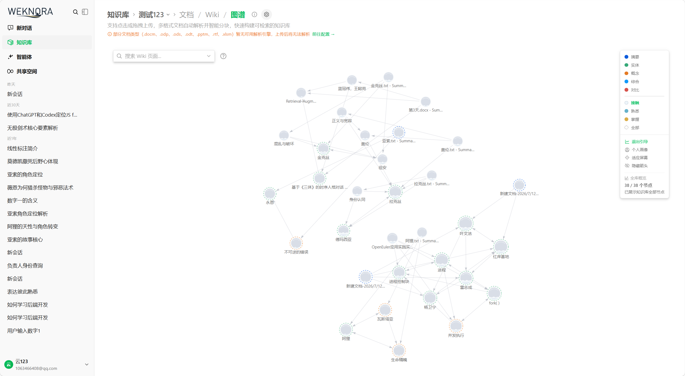
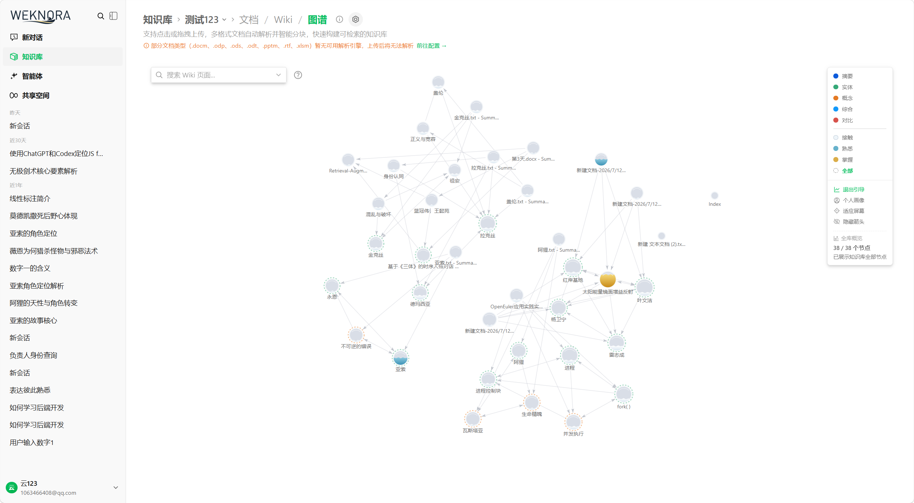
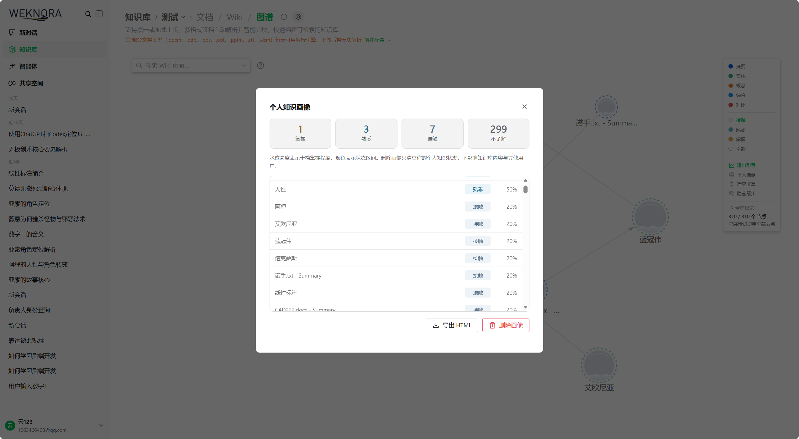
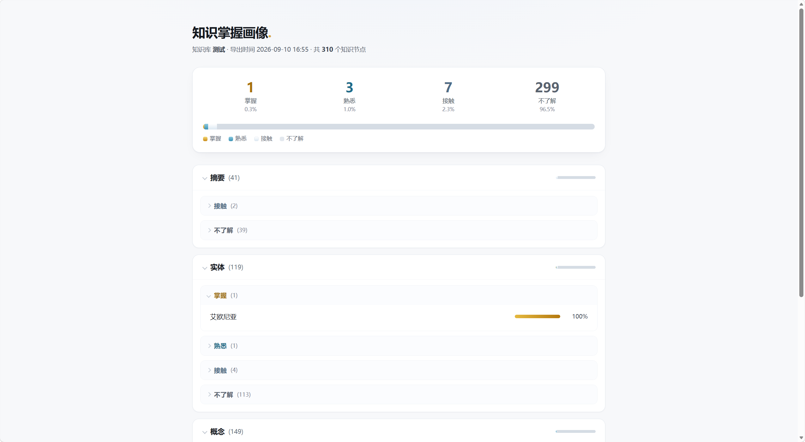

# 课题四 · 知识网络与引导式学习 —— 个人知识地图

> **WeKnora 开源实战课题** · 腾讯犀牛鸟开源人才培养计划
>
> 本文说明我们**解决了什么问题**、**用什么理念和算法实现**、**设计了哪些功能**、**哪些参数决定了用户体验**，以及**代码是怎么走的**。

---

## 目录

- [一、我们要解决的问题](#一我们要解决的问题)
- [二、用什么理念和算法](#二用什么理念和算法)
- [三、设计了什么功能](#三设计了什么功能)
- [四、什么参数决定了用户体验](#四什么参数决定了用户体验)
- [五、代码逻辑怎么走](#五代码逻辑怎么走)
- [六、完成度](#六完成度)
- [七、如何运行与验证](#七如何运行与验证)
- [附：可调参数总表](#附可调参数总表)

---

## 一、我们要解决的问题

### 1.1 问题与答案

WeKnora 的目标是帮用户**记住并熟悉自己的文档**——把散落的资料变成可检索、可复用、可持续累积的知识资产。在「记住」这一侧它已经做得很扎实：**用户长期记忆**从对话里提取这个人反复用过的文档，**Wiki 知识网络**把文档蒸馏成互链的页面与图谱。但这两块拼图**各走各的**：系统同时知道「这片知识长什么样」和「这个人用过哪些文档」，却从没把这两件事对上过。用户打开 Wiki 图谱时，看到的仍是一张按页面类型上色的**静态图**，与「我」无关。

我们想补上的是**「熟悉」这一侧的可见性**。既然用户已经在读、在引用、在认可，这些行为本身就构成了他与每个知识节点之间的**熟悉程度**；把它如实呈现出来，用户就能对自己的知识状况有更好的评估——哪些是真正熟悉的、哪些只是扫过一眼，还剩下哪些是盲区。

所以我们加了一层**个人知识地图**：把用户自己的行为（读过什么、引用过什么、认可过什么）投影到 Wiki 知识网络上，让每个节点亮起属于自己的水位。它同时回答三件事——**地图**回答「我在哪里」，**画像**回答「我的水位是由什么构成的」，**引导**回答「下一步该看哪里」。

需要说明的是，这里**没有任何考试式的设计**：没有问答闯关，也没有「回忆一下这个知识点」的环节。我们只做一件事——**如实呈现你已经产生的行为证据**。因此这套水位表达的是「用户与这个知识节点的关联强度与近期活跃度」，而**不是对用户真实认知能力的判断**；引用不等于理解，浏览不等于读懂，点赞认可的是「回答」而非「逐篇文档」，「掌握」也只是个 UI 标签，语义是「高证据活跃」。把这条边界写在最前面，是因为它决定了后面每一个算法决策：我们做的是一个**行为证据的累积器**，不是一个**认知能力的评分器**。

### 1.2 课题要求对照

| 课题要求 | 我们的交付 |
|---|---|
| **关联**：记忆条目与知识内容如何建立映射，节点取什么粒度 | 选 **Wiki 页面**为节点；四路映射（引用/点赞经 `SourceRefs` 反查、浏览/预热按 slug 直接落页） |
| **度量**：用什么信号刻画掌握程度，如何避免模型主观打分 | **四类纯行为信号 + 确定性纯函数**，零模型判断 |
| **引导**：推荐下一步，形成可迭代闭环 | PPR 边界识别；一跳邻居取交集；**展示→点击→合格浏览**三段闭环 |
| **呈现**：知识网络如何可视化，「点亮」如何被感知 | 十档水位球、水波动效、档位筛选、边界涟漪（见第三章截图） |
| **设计说明** | 本文档（第一~六章） |
| **可运行原型** | 后端 8 接口 + 6 账本 + 双端迁移；前端完整可视化与交互 |
| **验证有效性** | 离线回放为首选方案，数据基础全部就位、**回放任务未实现**（见 6.4；局限声明见 6.5 第 4 条） |
| **租户隔离 + 查看 / 导出 / 删除** | `scoped()` 隔离 + 3 个画像接口 + 前端弹窗 + 关闭开关 |

> 课题说明「可以只做其中一部分」，我们**四个角度全部实现**，并让它们互相咬合：关联决定节点粒度，度量决定水位算法，引导消费水位产出推荐，呈现把整条链路可视化。

---

## 二、用什么理念和算法

### 2.1 理念一：只用行为，完全不用模型打分

课题给出的核心约束是「**度量如何避免退化成模型主观打分**」。我们的回答非常直接：

> **一个模型调用都没有。**

刻画状态的是**四类纯行为信号**，每一条都来自系统可审计的事件：

| 信号 | 语义 | 它回答的问题 | 权重 | 封顶 |
|---|---|---|---|---|
| **引用** | 系统关联：该文档进入了最终回答 | 系统是否把这篇关联进来了 | `CitationWeight = 1` | `CitationCap = 3` |
| **浏览** | 直接接触：用户主动打开并有效停留 | 是否真的接触了这个页面 | `ViewWeight = 2` + 每 60 秒 1 分 | 单次 300 秒 |
| **点赞**（我独到的设计） | 间接认可：用户认可整条回答 | 这条回答是否有用 | `LikeWeight = 2` | 次线性封顶，按位置分摊 |
| **邻居预热** | 周围阅读带来的温度 | 这个节点是否被周围的阅读带动 | 源页阅读时长的 20% | `SpreadCap = 6` |

**行为分层原则**：只统计**强行为**，**不统计系统内部过程**——

```
被检索到（出现在候选集里）  ✗ 不算证据 —— 用户未必看到它
进入最终回答引用            ✓ 算 —— 系统侧关联证据（弱）
用户主动打开并停留          ✓ 算 —— 直接接触证据（强）
用户点赞 AI 回答            ✓ 算 —— 对整条回答的认可（间接）
```

### 2.2 理念二：按语义分工，不建单一权重链

一个容易掉进去的陷阱是排一条「显式 > 主动 > 被动」的权重链。我们没有这样做，因为这四个信号**回答的根本不是同一个问题**：

- 引用回答「**系统**是否关联了该文档」
- 浏览回答「**用户**是否真的接触了这个页面」
- 点赞回答「**这条回答**是否有用」
- 预热回答「这个节点是否被**周围的阅读**带动了」

所以它们在打分中**各算各的**，而不是互相替代。这也是为什么下面的水位公式是**相加**而不是取最大值。

### 2.3 算法一：证据集 → 十档水位（确定性纯函数）

**代码位置**：`internal/application/service/mastery/level.go`

```go
func Level(cfg Config, e Evidence, now time.Time) int
```

**输入**是一个「证据集」——每类信号独立携带自己的数据与时间戳：

```go
type Evidence struct {
    Citations    int        // 引用次数（受 CitationCap 封顶）
    LastCitedAt  time.Time  // 最近一次引用
    Views        int        // 有效浏览次数
    Duration     int64      // 累计有效浏览秒数
    LastViewedAt time.Time  // 最近一次浏览
    Likes        float64    // 点赞分摊后的加权值（保留小数）
    LastLikedAt  time.Time  // 最近一次点赞
    ViewSlices   []ViewSlice   // 浏览证据的「按天切片」
    SpreadSlices []SpreadSlice // 邻居预热的「按天切片」
}
```

**输出**是 `0..100` 的十档水位：

```
 0               无证据
 10 / 20 / 30    接触      （TouchScore = 1 起）
 40 / 50 / 60    熟悉      （FamiliarScore = 4 起）
 70 / 80 / 90    掌握      （MasteredScore = 8 起）
 100             证据饱和   （SatScore = 12）
```

**计算过程分四步**（`level.go:79`）：

**第一步：先判饱和，用的是「未衰减总量」**

```go
cite := math.Min(float64(e.Citations), cfg.CitationCap) * cfg.CitationWeight
view := e.rawViewScore(cfg)
like := e.Likes * cfg.LikeWeight

if cite+view+like >= cfg.SatScore {
    return 100
}
```

这一步有两个刻意的设计：

1. **用未衰减的总量判定**——所以饱和是**单向**的：证据够了就恒为 100%，不因为忙了几天没来而掉档。「学过的不会因为忙了几天就消失」。
2. **只算自己的证据**——邻居预热**不参与**这个判定。借来的温度可以让节点更亮，但**永远不能宣布一个节点「饱和」**。

**第二步：各信号独立衰减后求和**

```go
score := cite*decayFactor(cfg, now, e.LastCitedAt) +
    e.decayedViewScore(cfg, now) +
    like*decayFactor(cfg, now, e.LastLikedAt) +
    e.decayedSpreadScore(cfg, now)
```

**第三步：映射到档位**（`scoreToLevel`，`level.go:222`）

```go
case score >= cfg.SatScore:      return 100
case score >= cfg.MasteredScore: return subdivide(8, 12, 70, score)
case score >= cfg.FamiliarScore: return subdivide(4, 8, 40, score)
case score >= cfg.TouchScore:    return subdivide(1, 4, 10, score)
default:                         return 10
```

`subdivide(lo, hi, base, score)` 把分数在档内**线性细分**成三个水位（如熟悉档 4~8 分映射到 40/50/60），四舍五入到最近的十档。

**第四步：把借来的分数挡在「掌握」档外**

```go
if level == 100 {
    level = 90
}
```

100% 永远保留给**用户自己的证据**（第一步的短路已经保证了这一点）。邻居预热最多能把节点推到 90%。

**为什么坚持做成纯函数？**

| 性质 | 带来的能力 |
|---|---|
| 无模型、无随机 | 结果可解释：用户问「为什么是这个水位」，我们能逐项算出每个信号的贡献 |
| 无隐藏状态 | **可回放**：给定证据集与时间点，能重算出任意历史时刻的水位，不需要重跑历史代码 |
| 确定性 | **可测试**：同样的输入必得同样的输出，55 个单元测试正是建立在这条性质上 |

### 2.4 算法二：分信号 + 分日衰减

**代码位置**：`level.go` 的 `decayFactor` / `decayedViewScore` / `decayedSpreadScore`

衰减负责让水位**回落**。最朴素的做法是「用一个时间戳衰减全部证据」，但那会犯一个典型错误：

> 汇总行只有一个「最近浏览时间」。用它整体衰减，
> **今天一次 5 秒的扫视，就会把「一个月前积累的阅读」整体保鲜**。

所以衰减由**五条规则**共同刻画：

**① 分信号独立衰减**——引用、浏览、点赞、预热各按自己的最近时间衰减。否则「今天一次轻微浏览」会给「一个月前的引用」整体保鲜。

**② 浏览与预热再按「日历日」切片**——每一天的阅读**各自承担自己的衰减**：

```go
func (e Evidence) decayedViewScore(cfg Config, now time.Time) float64 {
    if len(e.ViewSlices) == 0 {
        return viewScore(cfg, e.Views, e.Duration) * decayFactor(cfg, now, e.LastViewedAt)
    }
    var score float64
    for _, s := range e.ViewSlices {
        score += viewScore(cfg, s.Views, s.Duration) * decayFactor(cfg, now, s.Day)
    }
    return score
}
```

这样「一个月前认真读过、今天扫了一眼」就**不会再长得像「今天认真读过」**。

**③ 衰减有下限**（`DecayFloor = 0.35`）

```go
func decayFactor(cfg Config, now, last time.Time) float64 {
    if last.IsZero() {
        return cfg.DecayFloor  // 时间戳缺失按最古老处理，宁可失效也不永久保鲜
    }
    days := now.Sub(last).Hours() / 24
    if days <= 0 {
        return 1
    }
    factor := math.Exp(-days / cfg.HalfLifeDays)
    if factor < cfg.DecayFloor {
        return cfg.DecayFloor
    }
    return factor
}
```

节点回落到**沉寂**，而不是退回**从未接触**——学习痕迹始终可见，忙了几天也不会「像白学了」。

**④ 饱和单向**——见 2.3 第一步。

**⑤ 冷端折叠（性能）**：

```go
func (c Config) ColdHorizon() time.Duration {
    days := math.Log(1/c.DecayFloor) * c.HalfLifeDays
    return time.Duration((days + 1) * float64(24*time.Hour))
}
```

超过这个地平线的每一天，其衰减因子**都已经贴在下限上**，所以「逐日展开求和」与「先求和再乘同一个下限因子」**结果完全相等**。于是冷端日桶可以安全折叠成一条——读取代价只与「访问过的页面数」有关，**与天数无关**。

> 折叠不是近似，而是**等价**。这一点由一条专门的等价性测试钉住（`service_spread_test.go`）。

### 2.5 算法三：PPR 识别「知识边界」

**代码位置**：`internal/application/service/mastery/boundary.go`

```go
func ComputeBoundary(levels map[string]int, adjacency map[string][]string,
                     familiarScore, topK int) []BoundaryNode
```

**要解决的问题**：用户已经熟悉了一片区域，那么「最值得看的下一步」不是全图随机节点，而是**紧挨着这片区域、但自己还很生疏**的节点——也就是**知识边界**。

**做法**：

1. **种子**：把所有 `level >= 40`（熟悉档）的节点作为个性化起点；
2. **冷启动短路**：如果没有种子（用户什么都没学），**直接返回 nil，不制造任何推荐**；
3. **个性化 PageRank 迭代**：

```go
p[s] = 1.0 / len(seeds)      // 重启分布均分在种子上
r = alpha*p + (1-alpha) * A^T r    // alpha = 0.15, tolerance = 1e-8, maxIter = 100
```

4. **筛选候选**：排除已经熟悉的（`level >= familiarScore`）和分数为 0 的；
5. **排序**：PPR 分数降序 → slug 升序兜底；
6. **截断**：取 Top-K（默认 `DefaultBoundaryTopK = 12`）。

输出的 `slug → score` 有两层用途：**分数 > 0** 表示「这个节点在边界上」（前端画涟漪），**分数本身**用于对一跳邻居排序（生成抽屉里的「继续探索」推荐）。

它同样是**纯函数**——输入相同，输出必然相同，可单测、可回放。

### 2.6 算法四：点赞的次线性分摊

**代码位置**：`internal/application/service/mastery/allocate.go`

一次「点赞」针对的是**整条回答**，但一条回答可能引用了好几篇文档。如果简单地给每篇都加满分，一条长答案就能把整片图点亮。

所以我们的做法是**总增益次线性封顶 + 按位置衰减分摊**：

```go
switch {
case len(cleaned) == 1:   total = 1.0
case len(cleaned) <= 3:   total = 1.3
default:                  total = 1.5   // 封顶
}

weights[i] = 1.0 / float64(i+1)          // 位置衰减：越靠前权重越大
CreditedWeight = total * weights[i] / sum // 归一化后按份额分配
```

**三个设计点**：

1. **次线性**：1 篇得 1.0，2~3 篇总共得 1.3，4 篇以上总共只有 1.5——**回答越长，每篇分到的越少**；
2. **位置衰减**：`1/(i+1)` 让**排在前面的引用**（通常是更核心的来源）分得更多；
3. **可精确回滚**：分摊结果作为**快照**存进 `memory_answer_likes.allocations`，取消点赞时按原权重精确扣回，而不是「估个数扣掉」。

### 2.7 第四类证据：邻居预热，以及它的两条硬边界

**读一个页面时，与它相邻的页面**（出链 ∪ 入链，一跳、去重）会获得一次**上下文预热**。

这个设计的出发点是：**「周围在读什么」应该能温和地影响我的知识地图**，而不是只在视觉上闪一下。但归因必须收得很紧，所以规则刻意保守：

| 规则 | 实现 | 为什么 |
|---|---|---|
| **只按阅读时间折算** | `Seconds × DurationWeight × SpreadFactor(0.2)` | 扫一眼几秒的 20% 在分数上约等于零，只会让邻居停在最低档 10% |
| **只传一跳** | 不做多跳传播 | 多跳会让归因失控（「我读 A，A 连着 B，B 连着 C，所以 C 也算我的」） |
| **按天记账** | 与浏览证据同构的 `SpreadSlice` | 可逐日衰减、可参与冷端折叠 |

**两条硬边界**（都在代码里显式实现）：

1. **预热不计入饱和判定**——100% 永远只能由自己的引用、浏览、点赞达成；
2. **单靠预热上限 50%**——`SpreadCap = 6` 分，落在熟悉档中段；**掌握档（≥70）只能由自己的证据产生**。

量级参考（每次顶格阅读 300 秒 = 1 分预热）：

```
邻居当天被认真读 2 次 → 20%
邻居当天被认真读 4 次 → 40%
邻居当天被认真读 6 次及以上 → 封顶 50%
```

### 2.8 去偏：三条防线

现有检索重排会让「过去引用过的文档」更容易被再次检索、再次被引用。如果同时把引用次数解释成「掌握」，就会形成自我强化：

```
越被推荐 → 越被引用 → 越像熟悉 → 越被推荐 → ...
```

因此我们守住三条边界：

1. **状态只统计强行为**——不统计因个性化加权进入候选集的内容；
2. **状态模型只用于呈现与引导**——不反向增强检索加权（现有 `affinityFactor` 保持「小幅、封顶」）；
3. **引用信号设上限**——同一回答同一文档只记一次，`CitationCap = 3` 让引用再多也进不了掌握档。

还有一个容易忽略的点：**同一条回答的「引用」与「点赞」不是两份独立的多样性证据**。引用提供「该文档参与了回答」的基础关联，点赞为这一次关联增加一次正向确认；真正有辨识力的强化来自**不同问题、不同时间的重复正反馈**，或用户进一步打开相关 Wiki 页面。

---

## 三、设计了什么功能

### 3.1 一个开关，两个世界

个人知识状态是一层**叠加层**，不是替换层。所以它被一个开关与主流程隔开：

| 视图 | 内容 |
|---|---|
| **正常浏览**（默认） | 现有 Wiki 能力照旧：目录树 + 页面 + 普通图谱，节点按类型着色 |
| **知识引导**（一键切换） | 个人知识地图：灰球 + 水位，点开节点有涟漪与推荐，支持按档筛选 |

开关状态持久化到 `localStorage`，刷新后保持用户的选择。**这个开关本身就是对「负面效果评估」的制度化回答**——把「正常浏览」和「学习视角」两种诉求隔离开，不打扰问答主流程。

### 3.2 水位球：把状态渲染成一个看得见的东西

**初始态**——所有节点都是灰球，水位 0%，代表这个用户还没有产生任何行为证据：



**产生行为证据后**——节点内出现水位：**蓝水表示接触 / 熟悉**，**金水表示高证据活跃**；水位**高度**即十档掌握度：



视觉元素的语义是分层的，而且**互相不干扰**：

| 视觉元素 | 表达内容 |
|---|---|
| 灰色空球 | 暂无行为证据（水位 0%） |
| 白水 / 蓝水 / 金水 | 接触（10~30%）/ 熟悉（40~60%）/ 高证据活跃（70~90%） |
| **球内水位高度** | **十档水位**（状态本身） |
| **水面微波** | **近期活跃**——最近 7 天有交互才流动，**与水位高度无关** |
| 满格静止金球 | 证据饱和（100%），无波动 |
| 水面趋于平静 | 长期未接触，水位回落但保留痕迹 |

注意「水位」和「水波」是**两个独立的量**：一个刚读过的高水位球会流动，一个很久以前学过的高水位球静止；一个刚扫过的低水位球也会有轻微波纹。

### 3.3 点开一个节点：关系高亮 + 边界涟漪 + 下一步推荐

用户点击某个节点时，前端分两层响应：

1. **所有一跳邻居与连线**做轻微关系高亮——帮助理解结构；
2. 其中**处于知识边界**（PPR 候选中、且当前水位低）的邻居，亮起**淡金色涟漪**——提示值得探索。

同时，节点详情抽屉里给出**「继续探索」**的 1~3 项明确推荐：

| 环节 | 规则 |
|---|---|
| **候选范围** | 只取当前节点的**一跳邻居**（出链 ∪ 入链）∩ 全局 PPR 边界候选集 |
| **排除** | 当前节点、`index` 页、水位 ≥ 40（已熟悉）、不可打开或无内容的页面 |
| **排序** | PPR 边界分数降序 → 当前水位越低越优先 → 页面类型（摘要/实体/概念优先） → 标题兜底 |
| **数量** | 最多 3 个；**没有合适候选就不显示，不强行凑数** |
| **冷启动** | 没有高证据节点时，不产生任何推荐 |

**涟漪和推荐是同一套机制的两个表现层**——共用同一批候选，**不建立第二套推荐逻辑，也不引入新的推荐算法**。

### 3.4 个人知识画像：查看 / 导出 / 删除

地图回答「我在这片知识空间的哪里」，**画像回答「我的水位是由哪些行为构成的」**。它不引入第二条数据通路，每个节点的水位与地图上那个球**共用同一次计算**。

**入口**：只在知识引导视图开启后出现（图谱图例栏里的「个人画像」按钮）。

**弹窗**——四档概览 + 节点明细：



| 区块 | 内容 |
|---|---|
| ① 四档概览 | 掌握 / 熟悉 / 接触 / 不了解 四个数字卡，配色与地图水位一致 |
| ② 口径提示 | 说明水位含义，以及「删除画像只清空你的个人知识状态」 |
| ③ 节点明细 | 每行 = 节点名 + 档位标签 + 水位百分比，按水位降序 |
| ④ 空态 | 「暂无行为证据。浏览、引用或点赞后，这里会生成你的知识画像。」 |
| ⑤ 操作 | 导出 HTML / 删除画像（二次确认） |

**导出报告**——自包含单页 HTML，无外部依赖、可离线打开：



由后端 `renderProfileHTML`（`internal/handler/mastery.go:423`）直接生成，结构为：

```
页头     知识掌握画像 · 知识库名 · 导出时间 · 节点总数
概览卡   四档数字与占比 + 一条横向堆叠「分布条」（形如水位谱）+ 图例
一级桶   按页面类型：摘要 → 实体 → 概念 → 综合 → 对比 → 索引
         每个桶标题右侧带一条迷你分布条，一眼看出该类型的档位构成
二级桶   每个类型内再按 掌握 → 熟悉 → 接触 → 不了解 分折叠子桶（「掌握」默认展开）
节点行   节点名 + 水位条 + 百分比（水位为 0 时置灰）
页脚     产品署名
```

**同一套色值（金 / 蓝 / 白 / 灰）在图谱、画像弹窗、导出报告三处保持一致**，用户不需要重新学习图例。导出也遵守无障碍约定（`prefers-reduced-motion` 时禁用过渡动画），通过带鉴权的 blob 下载，文件名 `mastery-profile.html`。

### 3.5 图谱探索：Bloom 与 Grow Frontier

除上述交互外，图谱还提供两条「扩张邻居」的路径，用于聚焦后继续探索：

| 交互 | 触发 | 行为 |
|---|---|---|
| **Bloom**（扩张邻居） | 节点上的展开按钮，或 Shift + 点击 | 在当前 ego 视图上增量加入该节点的一跳邻居；若还在总览视图，则先 pivot 成以它为中心的 ego 视图 |
| **Grow Frontier**（沿前沿生长） | 一键 | 找出画面上所有仍带展开环的节点，并行发起请求、合并后重绘并保持布局——是 Bloom 的批量版本 |

**这两条路径只改变「画布上有哪些节点」，不改变任何节点的水位或档位**，与知识引导层正交。

### 3.6 视频演示

**演示一：知识引导视图**

https://github.com/user-attachments/assets/5239fa60-dae4-4571-9d32-cb2fabd901f5

*在知识引导视图中查看节点水位、相邻关系高亮与边界涟漪。*

**演示二：个人知识画像**

https://github.com/user-attachments/assets/95e0613e-0550-42eb-86a7-e8f0973b136d

*查看个人知识画像的节点明细，并导出 HTML 报告。*

---

## 四、什么参数决定了用户体验

这一章回答一个很实际的问题：**为什么现在的体验是「上手快、反馈稳、不焦虑」，而不是「涨得慢」或「涨得假」？** 答案几乎全在这组参数里。

### 4.1 参数在哪里

所有可调项**集中定义、双侧同步**，业务代码里不写死：

| 位置 | 内容 |
|---|---|
| `internal/application/service/mastery/config.go` | 后端 14 个常量（权重、封顶、衰减、档位阈值） |
| `internal/application/service/mastery/boundary.go` | 5 个 PPR 常量（种子阈值、Top-K、阻尼 α、收敛容差、迭代上限） |
| `internal/types/mastery.go` | 1 个：`MasteryMaxPageViewSeconds`（单次浏览封顶 300 秒，与前端 `PAGE_VIEW_MAX_SECONDS` 同值） |
| `frontend/src/views/knowledge/wiki/WikiBrowser.vue` | 前端 4 个常量（计时清洗、动效） |

### 4.2 五条一致性约束：这些参数不能单独乱调

`DefaultConfig()` 的注释里写明：这些值**是推导出来的，不是拍脑袋的**。它们互相之间满足五条约束：

| 约束 | 数学表达 | 它保证了什么 |
|---|---|---|
| 证据强度单调 | `ViewWeight(2) ≥ LikeWeight(2) > CitationWeight(1)` | 直接接触 ≥ 间接认可 > 系统关联 |
| **单次挂机不可能饱和** | `2 + 300 × (1/60) = 7 < SatScore(12)` | 一次超长浏览也顶不到 100% |
| 一次引用恰落在接触起点 | `CitationWeight(1) = TouchScore(1)` | 「引用即接触」的语义对齐 |
| 引用进不了掌握档 | `CitationCap(3) < MasteredScore(8)` | 单篇文档无法主导一个页面 |
| 借来的温度进不了掌握档 | `SpreadCap(6) < MasteredScore(8)` | 邻居预热最多到 50% |

**其中第 2 条最值得展开说**——它是「参数决定体验」最有代表性的例子：

```
一次「顶格」浏览（封顶 300 秒）能拿到多少分？
    浏览证据 = ViewWeight(2) + 300 × DurationWeight(1/60) = 2 + 5 = 7 分
    而饱和阈值 SatScore = 12 分

    7 < 12   →  单次挂机浏览，无论多久，都不可能把节点刷到 100%
```

**如果反过来把上限放宽到 1800 秒（30 分钟）**：`2 + 30 = 32 ≥ 12`，**一次挂机就能饱和**，这条性质立刻被破坏。

所以「300 秒上限」和「12 分饱和线」是**一组耦合常量**——调其中一个必须复核另一个。这就是为什么我们要把它们写在一起、并在注释里互相标注。

### 4.3 参数 → 体验的因果表（后端）

| 参数 | 值 | 它决定了什么体验 | 调大会怎样 | 调小会怎样 |
|---|---|---|---|---|
| `ViewWeight` | 2 | 一次有效浏览值多少 | 涨得快、很爽，但水位不值钱 | 涨得慢、更准，但容易挫败 |
| `DurationWeight` | 1/60 | 每一秒阅读值多少 | 时长主导，挂机收益变高 | 只看次数，深度阅读不被奖励 |
| `CitationWeight` / `CitationCap` | 1 / 3 | 引用能推到多高 | 一次提问就能点亮一片，失去区分度 | 引用几乎无感，用户觉得白问了 |
| `LikeWeight` | 2 | 点赞的分量 | 点赞主导，容易被刷 | 点赞无感，用户不愿意点 |
| `SpreadFactor` | 0.2 | 邻居能「借」到多少温度 | 看别人读 ≈ 自己学会，归因失真 | 无协同感，图失去「活的」感觉 |
| `SpreadCap` | 6 | 借来的温度上限 | 突破 50%，邻居能推到掌握档 | 协同感太弱 |
| **`SatScore`** | 12 | **多久能「满」** | 永远满不了，失去激励物 | 太容易满，失去含金量 |
| `MasteredScore` | 8 | 掌握档的门槛 | 掌握变稀有，多数人停在熟悉 | 掌握泛滥，不再有成就感 |
| `HalfLifeDays` | 30 | 多久回落到一半 | 痕迹近乎永久，图变得不真实 | 消退太快，用户觉得努力白费 |
| `DecayFloor` | 0.35 | 离开后保留多少痕迹 | 永不衰减（等价于没有衰减） | 归零，回到「从未接触」 |
| `FreshnessDays` | 7 | 水波流动多久 | 到处在晃，变成噪音 | 一晃就停，看不出「活跃」 |

> 上表展开 12 个；另 2 个是档位下限 `TouchScore = 1` / `FamiliarScore = 4`，它们的约束作用见 4.2（一次引用恰落在接触起点、4 分起进入熟悉档）。

### 4.4 参数 → 体验的因果表（前端）

| 参数 | 值 | 它决定了什么体验 | 为什么是这个值 |
|---|---|---|---|
| `PAGE_VIEW_MIN_SECONDS` | **5** | 多短的停留算「误点」 | 低于 5 秒视为扫视/误触，不上报。太小会把快速翻阅的**真实阅读**误丢，太大则容易把随手点开也记成一次证据 |
| `PAGE_VIEW_MAX_SECONDS` | **300** | 单次浏览最多算多久 | 与后端 `MasteryMaxPageViewSeconds` **同值**（服务端二次钳制，客户端被篡改也刷不高） |
| `WATER_FLOW_SECONDS` | **4** | 水波横移一个球径要几秒 | 「既看得出在流动，又不显得着急」。相位推进与刷新率解耦（按 `Δt` 推进，单帧上限 64ms），60Hz / 120Hz / 掉帧下流速一致 |
| `WATER_ANIM_MAX` | **24** | 同时最多几个球在动 | 地图上可有数百个球，全部逐帧重算路径会拖垮渲染。超出时按「选中 > 邻居 > 最近活跃 > 水位高」录取，其余保持静止水面 |

### 4.5 参数治理

- **集中定义**：体验参数与 PPR 算法常量各自集中在固定位置（见 4.1），业务代码不写死阈值、权重、窗口、上限——唯一的例外是实现层的批大小安全阀（`masteryWriteBatchSize`），它只决定一条语句装多少行，不参与任何评分；
- **双侧同步**：后端与前端常量在注释中互相注明（如 `PAGE_VIEW_MAX_SECONDS` ↔ `MasteryMaxPageViewSeconds`）；
- **标注耦合关系**：参数之间标注依赖（见 4.2），避免单侧调整破坏既有性质；
- **单侧不可私自调**：改 `ViewWeight` 要复核 `SatScore`，改 `SpreadFactor` 要复核 `SpreadCap`。

---

## 五、代码逻辑怎么走

这一章从**一次真实的用户操作**出发，把整条链路走一遍，并标出每一步的代码位置。

### 5.1 全景：三个写入口，一条读主干

```
写入口（产生证据）              读主干（消费证据）
├── POST /memory/page-view      GET  /wiki/graph?mastery=true   → 图谱水位
├── POST /memory/answer-like    GET  /memory/mastery            → 画像 JSON
└── (内部) 回答引用双写          GET  /memory/mastery/export     → 画像 HTML
                               + POST /memory/exposure[/click]  → 引导闭环
```

### 5.2 链路一：用户读一个页面（写路径）

这是**最核心的一条链路**，因为浏览是唯一的「强证据」。

```
【前端】打开页面抽屉 / 阅读器
   startPageViewTimer(slug)            计时器每秒自增，仅在 visibilityState === 'visible' 时累计
        │
        ├─ 用户切换页面 / 关闭抽屉 / 切回图谱
        │     flushPageView()            先结算旧页（返回 Promise，切视图前 await），再启动新页
        │
        └─ 停留 ≥ 5 秒 → 上报
              POST /api/v1/memory/page-view { knowledge_base_id, slug, duration }
                    │
【后端】handler/mastery.go:61  RecordPageView
        ├─ 校验 kb_id / slug / duration
        ├─ 钳制 duration ≤ 300                  ← 服务端二次钳制，不信客户端
        ├─ GetPageBySlug 校验页面真实存在       ← 不信客户端，伪造 slug 直接 404
        ├─ 取 SourceKnowledgeIDs() 与一跳邻居（OutLinks ∪ InLinks）
        └─ service.RecordPageView(...)
              │
【服务】service.go:40  RecordPageView
        ├─ 再钳制一次 duration ≤ MasteryMaxPageViewSeconds
        ├─ ResolveScope(ctx)                    ← 从请求上下文取租户+用户，绝不信客户端 id
        ├─ repo.BumpPageView                    写入 memory_page_views + memory_mastery_daily
        ├─ repo.BumpSpreadViews                 给一跳邻居写「预热」（一条多行 upsert）
        └─ repo.MarkExposureQualified           若该 slug 曾是边界候选 → 回填合格浏览（闭环）
              │
【回传】handler 组装响应
        ├─ NodeStateForSlug(重算该节点最新状态；窄查询，只读这一个节点的账本)
        └─ { success, mastery, recently_active, last_active }
              │
【前端】applyFreshMastery(slug, mastery, recentlyActive)
        ├─ 同步回「源数据」graphData.nodes    ← 档位筛选读的是这份，不同步会导致筛选时节点消失
        ├─ 同步回「渲染层」graphNodes
        └─ refreshNodeWater() 就地更新水位几何（不重拉整张图）
```

**这条链路里有三个刻意的顺序保证**：

1. **服务端钳制在 handler 与 service 各做一次**——绕过 handler 的调用路径也刷不高；
2. **邻居预热放在浏览写入成功之后**——避免「主证据写失败，却留下扩散痕迹」；
3. **前端「先结算旧页、再启动新页」，且结算函数返回 Promise**——切回图谱前 `await` 它，避免「新页图谱先拉、旧页证据后写」的竞态。

**回传的水位为什么必然等于地图上的球**：`NodeStateForSlug` **没有**复用图谱那次全量聚合——那样会为「一个节点」把整个知识库的账本读一遍（日桶更会随「页面数 × 天数」增长），而页面每读满一次就要回传一次。它改走一条**窄查询**：`LoadNodeLedger` 只读这个 slug 的浏览行与日桶、以及它来源文档的引用行；但**投影与档位映射用的是同一套函数**（`projectEvidence` + `stateFromEvidence` + `Level`）。所以两条路径不可能给出不同的数字——这与「画像与图谱共用同一次计算」是同一个保证（见 5.5）。

### 5.3 链路二：图谱是怎么算出来的（读路径）

这是**计算量最大**的一条链路：要把整个知识库的所有页面算一遍水位。

```
【前端】GET /knowledgebase/:id/wiki/graph?mastery=true
              │
【后端】service/wiki_page.go  GetGraph
        ├─ 遍历该知识库所有页面，构建 adjacency（出链 ∪ 入链）
        ├─ 收集 slugSources：页面 slug → 它引用的来源文档 id 列表
        └─ masteryService.NodeStates(ctx, kbID, slugSources)
              │
【服务】service.go:380  NodeStates → aggregate()
        │
        ├─ ① ResolveScope(ctx)                   租户 + 用户隔离
        ├─ ② 空 slugSources 提前返回              省掉后面四次账本查询
        ├─ ③ 四次账本查询
        │      ListCitations      → memory_citations
        │      ListPageViews      → memory_page_views
        │      ListActiveLikes    → memory_answer_likes（未取消的）
        │      ListDailyViews / ListDailySpread → 日桶（近端逐日 + 冷端折叠）
        ├─ ④ 计算 cutoff = now - ColdHorizon()   冷桶折叠的分界线
        ├─ ⑤ 投影：把「按文档」的证据折算到「按页面」
        │      引用 → 取该页面来源文档中【最强】的一个      ← 保守：不因单篇高频而高估整页
        │      点赞 → 累加各来源的分摊权重
        │      浏览 → 直接按 slug 命中（无需映射）
        │      日桶 → 展开成 ViewSlices / SpreadSlices（供逐日衰减）
        └─ ⑥ statesFromEvidence()
               Level(cfg, evidence, now)     ← 纯函数，逐节点算水位
               LastActive()                  三个信号取最大值
               RecentlyActive                now - LastActive ≤ FreshnessDays(7天)
              │
【回传】节点上附带 mastery / last_active / recently_active
        + Boundary(levels, adjacency)  → PPR 边界分数
              │
【前端】renderGraph()
        ├─ 按节点水位绘制水位球（几何自洽路径 + 缓动）
        └─ 对边界节点渲染涟漪
```

**投影里最容易出错的一步是「多来源页面」**：一个 `entity` / `concept` 页可能聚合了多篇来源文档。如果直接取最大引用数，会因为**单篇高频引用**而高估整页的熟悉度（用户可能只接触了页面的一小部分）。所以我们**取最强来源**，让投影保持保守。

### 5.4 链路三：点赞一条回答

```
【前端】点击 AI 回答的点赞按钮
              │
【后端】handler/mastery.go:118  RecordAnswerLike
        ├─ 校验 session_id / message_id
        ├─ messageService.GetMessage(sessionID, messageID)   ← 服务端加载消息，校验归属
        ├─ extractReferenceSources(msg.KnowledgeReferences)  ← 从【消息的真实引用】提取
        │      不信任客户端提交的文档列表
        └─ masteryService.RecordAnswerLike(messageID, refs)
              │
【服务】service.go:68
        ├─ AllocateLikes(refs)        次线性封顶 + 位置衰减 + 去重
        ├─ ResolveScope(ctx)
        └─ repo.RecordAnswerLike(like)  存「分摊快照」，供取消时精确回滚
```

**取消点赞**走 `DELETE /memory/answer-like/:message_id`，按快照里的 `credited_weight` **精确扣回**，而不是估算。

### 5.5 链路四：导出画像

```
【前端】GET /memory/mastery/export?kb_id=  （带鉴权的 blob 下载）
              │
【后端】handler/mastery.go:235  ExportProfile
        ├─ buildSlugMeta(kbID)          游标分页遍历所有页面（每批 500）→ slug → {title, pageType, sourceIDs}
        ├─ masteryService.Profile(...)  复用与图谱同一套 aggregate + Level
        ├─ fillProfileMeta(...)         回填标题与页面类型
        └─ renderProfileHTML(kbName, profile)
              分组：页面类型 → 档位
              生成自包含 HTML（内联 CSS，无外部依赖）
              Content-Disposition: attachment; filename="mastery-profile.html"
```

**关键点**：`Profile` 与图谱**共用同一次计算**（都走 `aggregate` + `Level`），所以画像里看到的数字与地图上的球**永远一致**，不存在「两套口径」。

### 5.6 后端模块地图

```
internal/application/service/mastery/     ← 纯算法 + 编排（无 HTTP、无 SQL）
├── config.go       参数集中定义；ColdHorizon() 推导衰减地平线
├── level.go        Level() / decayFactor() / scoreToLevel()  —— 证据集 → 十档水位
├── allocate.go     AllocateLikes()                           —— 点赞次线性分摊
├── boundary.go     ComputeBoundary()                         —— PPR 边界识别
└── service.go      Service：四个写入口 + aggregate 投影 + Profile/Boundary

internal/application/repository/mastery.go   ← 数据访问（六张账本，全走 scoped()）
internal/types/mastery.go                    ← 领域类型与常量（如 MasteryMaxPageViewSeconds）
internal/types/interfaces/mastery.go         ← 服务接口定义
internal/handler/mastery.go                  ← HTTP 层：校验、投影元数据、HTML 渲染
internal/router/routes_memory.go             ← 路由注册
```

**分层的价值**：算法层不依赖 HTTP 与 SQL，所以它能被**纯粹地单测**——55 个测试函数里有 40 个直接打在这些纯函数上，不需要起数据库。

### 5.7 前端关键链路

| 关注点 | 位置与做法 |
|---|---|
| **视图开关** | 状态持久化到 `localStorage`，刷新后保持 |
| **阅读计时** | `startPageViewTimer` / `flushPageView`：每秒自增、失焦暂停、换页先结算、切视图前 `await` |
| **就地刷新水位** | `applyFreshMastery`：同时写回 `graphData.nodes`（筛选数据源）与 `graphNodes`（渲染层），再 `refreshNodeWater` 局部重绘 |
| **水位球几何** | `waterGeometry` / `waterSurfacePathD` / `waterBodyPathD`：**几何自洽的封闭路径**——水面两端落在圆上、底边画成圆的下弧，**不依赖 `clip-path`** |
| **水波动效** | `ensureWaterFlow` / `tickWaterFlow`：只重写 path 的 `d`（波形在弦内平移），**不移动元素、不依赖裁剪**，所以水位永远被球体兜住 |
| **动效录取** | `grantWaterAnimation`：按「选中 > 邻居 > 最近活跃 > 水位高」排序取前 `WATER_ANIM_MAX` 个 |
| **档位筛选** | 前端本地过滤，读的是 `graphData.nodes` |
| **画像弹窗** | 概览 + 明细 + 导出（blob）+ 删除（二次确认，成功后重拉图谱让水位归零） |

**水位球渲染有一段值得一提的修复**：旧实现是「宽 4r 的超宽波浪 + `clip-path` 裁剪」——波浪要做横向无缝滚动，所以铺得比球宽，完全依赖裁剪。但 CSS transform 动画会把元素提升为合成层，**可能绕过 SVG 裁剪**，表现为水流出球外。新实现改成**几何自洽的封闭路径**：水面两端落在圆上、底边画成圆的下弧，波形改用**端点为 0 的包络正弦**、在弦内平移相位。这样水体在几何上**不可能**超出容器，裁剪彻底不再需要。

### 5.8 数据层：六张专用账本

**与既有 `memory_doc_affinity`（供检索重排用）完全解耦**——知识引导只读自己的账本，所以「删除画像」不会影响现有检索个性化。

| 表 | 写什么 | 谁在读 |
|---|---|---|
| `memory_citations` | 引用事件（与 `memory_doc_affinity` 双写但解耦） | 水位计算 / 画像 |
| `memory_page_views` | 页面浏览（次数 + 累计时长 + 最近时间） | 水位计算 / 画像 |
| `memory_answer_likes` | 回答点赞（含分摊快照，可精确回滚） | 水位计算 / 画像 |
| `memory_guide_exposures` | 引导曝光（展示 / 点击 / 有效浏览三段 + 位次 + 策略） | 闭环评估 |
| `memory_mastery_daily` | 日聚合行为桶（浏览与预热，按天） | **逐日衰减 + 冷桶折叠 + 离线回放** |
| `memory_spread_views` | 邻居预热（按天） | 水位计算 |

**写入的幂等与原子性**：

- 所有账本沿用 `scoped()` + `OnConflict` + 原子累加写法，**重试安全、并发安全**；
- 同页去重的「判定 + 自增」在**同一条 SQL 内**用 `CASE` 表达式完成，**不存在读写之间的竞态**；
- 邻居预热是**一条多行 upsert** 写完（页面平均连 8 个邻居、最多接近 60 个）——既避免把一次浏览放大成几十次数据库往返，也保证「要么全部邻居拿到温度，要么都没有」。

**迁移双端同步**：PostgreSQL `000093`~`000096`，SQLite Lite `000014`~`000017`，共 **8 组、16 个文件**。桌面 Lite 版无需额外部署即可运行。

### 5.9 同页去重：一个「参数决定行为」的典型

**规则**：同一节点在**同一天（服务器本地日历日）**内重复打开，**只折叠「浏览次数」，「浏览时长」照常累计**；当天起点固定，连续刷不会延长计数。

**为什么按天，而不是常见的 30 分钟窗？**

```
30 分钟窗：
    「每半小时点一次」→ 三小时就能攒满 6 次重复
    6 × ViewWeight(2) = 12 ≥ SatScore(12)  →  节点被推到【永久饱和】
    → 最省力的路径是「手速刷」

按天后：
    一天只折一次，最省力的路径变成「连续 6 天各来一次」
    → 从「手速刷」变成「真的坚持了六天」
```

**为什么只折次数、不折时长？**

- 要挡的是**次数刷分**：反复开关同一页面 6 次（约 30 秒操作）就能靠 `ViewWeight` 推到 100%；
- 不能丢的是**真实阅读**：当天第二次认真读几分钟是真实学习行为，丢掉它反而会逼用户「过会儿再来一遍」才能看到水位变化。

**三处同口径**：去重窗口、日聚合桶、曝光去重都按「一天」切分，语义一致。

---

## 六、完成度

### 6.1 交付规模

| 维度 | 规模 |
|---|---|
| 新增后端实现代码 | **3,076 行**（服务 1,130 / 仓储 799 / 类型·接口 445 / 接口层 702） |
| 单元测试 | **55 个测试函数、1,446 行**（测试与实现比 ≈ 47%） |
| 数据库迁移 | **8 组、16 个文件**（PostgreSQL 与 SQLite 双端同步） |
| 新增数据表 | **6 张专用账本**，与检索重排数据完全解耦 |
| 对外接口 | **8 个**（路径中不含 subject id，主体来自调用者身份） |
| 图接口扩展 | **1 个**（`?mastery=true` 附带水位、边界标记、最近活跃） |
| 前端交互 | **7 个模块**（视图开关、水位球、水波、档位筛选、推荐、画像、图谱扩展） |
| 可调常量 | 后端 20 个（config 14 / PPR 5 / 上限 1）+ 前端 4 个，集中定义、双侧同步 |
| 依赖新增 | **0**（不依赖 Neo4j，PostgreSQL 与桌面 Lite 均可运行） |

> **规模口径（可复现）**：以上为 `git diff --numstat upstream/main -- <路径>` 的 added 行数。
> 服务 = `internal/application/service/mastery/*.go`（不含测试）；仓储 = `internal/application/repository/mastery.go`；
> 类型·接口 = `internal/types/mastery.go` + `internal/types/interfaces/mastery.go`；接口层 = `internal/handler/mastery.go`；
> 测试 = `internal/application/service/mastery/*_test.go` + `internal/application/repository/mastery*_test.go`。
> 不含 `wiki_page.go` 的接入改动、路由注册与容器装配。

### 6.2 八个接口

| 方法 | 路径 | 用途 |
|---|---|---|
| `POST` | `/memory/page-view` | 上报有效浏览，**返回该节点最新水位供即时刷新** |
| `POST` | `/memory/answer-like` | 点赞回答（服务端按 session + message 读取真实引用） |
| `DELETE` | `/memory/answer-like/:message_id` | 取消点赞（按快照精确回滚） |
| `POST` | `/memory/exposure` | 记录边界候选曝光（含位次） |
| `POST` | `/memory/exposure/click` | 记录边界候选点击 |
| `GET` | `/memory/mastery?kb_id=` | 查看个人知识画像（节点明细 JSON） |
| `GET` | `/memory/mastery/export?kb_id=` | 导出 HTML 报告（附件下载） |
| `DELETE` | `/memory/mastery` | 删除个人知识画像 |

### 6.3 测试覆盖

| 层次 | 覆盖内容 | 数量 |
|---|---|---|
| 水位计算 | 无证据、引用封顶、浏览档位、多信号达档、衰减、分信号独立衰减、饱和单向、衰减下限、十档对齐 | 22 |
| 邻居预热 | 自身跳过、去重、累加、批量、封顶、不计入饱和、**冷端折叠等价性** | 5 |
| 点赞分摊 | 单来源、次线性封顶、位置衰减、去重、空输入 | 5 |
| PPR 边界 | 冷启动、低证据邻居命中、已熟悉节点排除、**Top-K 截断、排序确定性、孤立节点** | 6 |
| 证据投影 | **多来源页面取最强引用**、引用时间取最新、点赞跨来源累加、无关文档不泄漏、浏览按 slug 命中、日切片透传、无证据页面返回零值 | 7 |
| 同页去重 | 次数折叠、时长保留、跨用户隔离、日桶一致性 | 5 |
| 日桶读取 | 分日读取、折叠规则、冷端切分 | 4 |
| 账本读取一致性 | **单节点窄查询 vs 全库读取**：浏览行、浏览日桶、预热日桶、引用行逐项一致；未浏览过的页面返回空而非报错 | 1 |

**回归测试的价值举例**：去重测试会断言「6 次重复浏览 → 次数为 1、时长为 30」。如果有人移除去重逻辑，`view_count` 会变成 6，测试立刻失败——这条断言就是「按天折叠」这个设计决策的守门人。

### 6.4 有效性验证方式

**验证目标不是「证明系统准确知道用户掌握了什么」，而是「这个用户状态模型是否具有预测与引导价值」。**

**首选方案：离线回放（时间切分）**

```
输入：memory_mastery_daily      用户 × 节点 × 事件类型 × 日期
     memory_guide_exposures    展示 / 点击 / 有效浏览（含位次）

处理：按日期切分
     前一段 → 重建证据集 → 计算水位与知识边界
     后一段 → 检验用户是否真的继续访问这些节点

输出：下一次访问命中率 / Top-K 边界节点点击率 / 重复访问率 / 沉寂节点复访率
基线：本方案 vs 现有 Familiar 二值高亮 vs 随机 vs 按链接数排序
```

**为什么这条路径可行**：水位计算是纯函数、证据集可从日聚合桶完整重建、曝光日志已记录展示与点击——**这条验证路径所需的全部数据基础，在实现时就已经准备好**（日聚合桶的存在目的之一就是它）。

**闭环已经闭合**，不是一次性推荐：

```
展示（记曝光 + 位次）→ 点击（记点击）→ 有效浏览（记合格浏览 ← 唯一回报信号）
   ↓
沉淀进日聚合桶，供离线回放评估与未来的策略学习
```

「点击」与「有效浏览」**分开记录**——只有页面真的被停留阅读才算回报，避免把误点当成正反馈。

**另备两条**：小规模试用（对比普通 Wiki 图与知识地图）、负面效果评估（是否打扰主流程、是否让用户感觉被评估）。**引导视图默认关闭的开关，本身就是对负面效果评估的制度化回答。**

### 6.5 已知边界（如实声明）

写清楚是为了避免误用：

1. **引用与点赞尚未按天切片**——日聚合桶已在写入这两类事件，但评分仍读汇总行加单一最近时间戳，所以「今天一次引用或点赞给历史整体保鲜」在这两个信号上仍然存在（浏览与预热已切片，不受影响）；
2. **饱和是单向的，且浏览次数不封顶**——「连续 6 天各来一次」即可让节点永久停在 100%，而「认真读 5 分钟、30 天没来」会回落到 30% 附近。这是 2.3 第一步明确的取向（证据达标即恒为 100%、不让已建立的痕迹掉档），代价是长期注水比短期认真更划算；
3. **参数尚未经数据校准**——`HalfLifeDays = 30`、`DecayFloor = 0.35`、`SpreadFactor = 0.2`、`SpreadCap = 6` 与档位阈值 `1 / 4 / 8 / 12` 都是推导值（满足 4.2 的一致性约束），没有线上数据支撑；`Config` 目前是代码内默认值，调整需改代码；
4. **时间切分回放尚未接通**——浏览与预热维度已作为实时计算输入，但引用与点赞维度目前只写不读，回放任务本身（离线批处理、指标输出、基线对比）还没有实现。

### 6.6 租户隔离与用户控制

| 能力 | 接口 | 语义 |
|---|---|---|
| **查看** | `GET /memory/mastery?kb_id=` | 该知识库下当前用户的节点明细，可看到水位由哪些行为构成 |
| **导出** | `GET /memory/mastery/export?kb_id=` | 自包含单页 HTML，可离线打开 |
| **删除** | `DELETE /memory/mastery` | 清空当前用户的知识画像，二次确认 |
| **关闭** | 前端开关 | 仅停止显示，不删除数据——与「删除」是两个独立动作 |

**删除的边界（严格限定）**：

- 只清空六类**专用数据**（引用、浏览、点赞、曝光、日聚合桶、预热）；
- **不触碰** `memory_doc_affinity`：现有检索个性化重排照常工作；
- **不触碰**普通长期记忆；
- **不影响**知识库内容、Wiki 页面与其他用户。

**隔离**：所有画像读写都经过 memory 的 `ResolveScope` / `scoped()`，按「租户 + 用户」隔离；无 principal（如 API 调用）时自动跳过。同租户其他用户不可见。

**写入口的服务端校验**：浏览上报与点赞都会在服务端验证事件确实映射到调用者可见的真实对象（他浏览过的 Wiki 页面、他拥有的消息），**不信任客户端提交的文档列表**——保证「行为证据可审计」这一前提不被伪造的 payload 绕过。

---

## 七、如何运行与验证

### 7.1 环境要求

| 组件 | 版本 | 说明 |
|---|---|---|
| Docker + Docker Compose | 24+ | 一键启动 PostgreSQL / Redis / docreader / app / frontend |
| Go | **1.26.0**（见 `go.mod`） | 仅从源码编译或跑后端测试时需要 |
| Node.js | 20+ | 仅前端本地开发与前端测试时需要 |

本课题**没有引入任何新依赖**：不依赖 Neo4j，PostgreSQL 与桌面 Lite（SQLite）均可运行。

### 7.2 启动（推荐：Docker 一键起）

```bash
git clone https://github.com/wei-yan1/WeKnora.git
cd WeKnora
git checkout rhino-2026-final-4

cp .env.example .env        # 按需填写模型配置
docker compose up -d        # 首次构建需要数分钟
```

打开 `http://localhost`（默认端口 80，可用 `FRONTEND_PORT` 调整）。`.env` 至少要配一个对话模型与一个向量模型，否则 Wiki 生成与问答不可用；环境变量与模型接入的完整说明见仓库原有的 `README_CN.md`。

**本地开发（可选）**：

```bash
make dev-start                              # scripts/dev.sh：Docker 依赖 + 本地后端/前端
```

该脚本依赖 bash，Windows 下请在 WSL 或 Git Bash 中执行，或分别启动：

```bash
go run ./cmd/server                          # 后端
cd frontend && npm install && npm run dev    # 前端（Vite，默认 5173）
```

### 7.3 本课题特性的开启路径

本课题的功能全部挂在 **Wiki / 知识图谱** 视图上，且引导视图**默认关闭**（见 3.1）：

1. 新建知识库并上传文档，在知识库的索引策略中**开启 Wiki**（`wiki_enabled`）→ 等待 Wiki 页面与图谱生成；
2. 进入该知识库的 **Wiki / 知识图谱** 视图，在工具栏打开**知识引导开关**；
3. 打开任一 Wiki 页面并停留 ≥ 5 秒（`PAGE_VIEW_MIN_SECONDS`，低于此值视为误点不上报）→ 节点水位球随行为变化；
4. **点击节点**：查看关系高亮、边界涟漪与「下一步推荐」（PPR 边界候选，含曝光与点击记录）；
5. 与 Agent 对话后点击回答下方的**点赞**按钮 → 该次点赞按引用位置次线性分摊给被引用的文档；
6. **个人知识画像**：查看明细 / 导出单页 HTML / 删除。删除只清空个人六张专用账本，**不触碰**检索重排数据与知识库内容。

### 7.4 测试命令

```bash
# 本课题的后端测试：水位计算、邻居预热、点赞分摊、PPR 边界、同页去重、日桶读取
go test -count=1 ./internal/application/service/mastery/... ./internal/application/repository/... -v

# 全量后端测试
go test ./...        # 等价于 make test

# 前端：单测 + i18n 一致性 + 类型检查
cd frontend
npm install
npm run test         # tsx --test
npm run check-i18n   # 断言代码中引用的 i18n 键在五种语言包中都存在
npm run type-check
```

**已知环境差异（如实说明）**：Windows 上全量 `go test ./...` 可能因 duckdb 的 msys2 工具链缺失、系统临时目录被占用而失败，与本课题代码无关。本课题相关的两个测试包在 **Windows / SQLite** 下整体通过；涉及 SQL 方言的多行 upsert、`excluded` 列与 `SUM(0)` 读取形状，已在**真实 PostgreSQL** 上以临时表 + 回滚单独验证（不触碰真实数据）。

### 7.5 有效性验证

| 方式 | 状态 | 说明 |
|---|---|---|
| **可回归的行为断言** | **已实现** | 7.4 的两组测试包，例如「6 次重复浏览 → 次数为 1、时长为 30」这条断言是「按天折叠」设计决策的守门人 |
| **离线回放（时间切分）** | 数据基础就绪、回放任务未实现 | 见 6.4：`memory_mastery_daily`（用户 × 节点 × 事件类型 × 日期）与 `memory_guide_exposures`（展示 / 点击 / 有效浏览 + 位次）已按回放所需的口径写入 |
| **小规模试用** | 可按 7.3 复现 | 按 7.3 操作一遍即可观察到「点亮」过程、边界推荐与画像导出结果 |

---

## 附：可调参数总表

**后端**（`internal/application/service/mastery/config.go`；`MasteryMaxPageViewSeconds` 在 `internal/types/mastery.go`）

| 常量 | 值 | 含义 |
|---|---|---|
| `CitationCap` / `CitationWeight` | 3 / 1 | 引用封顶与权重 |
| `ViewWeight` / `DurationWeight` | 2 / `1/60` | 浏览次数权重 / 每秒时长权重 |
| `LikeWeight` | 2 | 点赞权重（分摊后计入） |
| `SpreadFactor` / `SpreadCap` | 0.2 / 6 | 邻居预热折扣 / 上限 |
| `HalfLifeDays` / `DecayFloor` | 30 / 0.35 | 衰减半衰期 / 下限 |
| `FreshnessDays` | 7 | 最近活跃窗口（仅驱动水波，不影响水位） |
| `TouchScore` / `FamiliarScore` | 1 / 4 | 接触 / 熟悉档起点 |
| `MasteredScore` / `SatScore` | 8 / 12 | 掌握档起点 / 饱和阈值 |
| `MasteryMaxPageViewSeconds` | 300 | 单次浏览时长封顶（服务端二次钳制） |
| 同页去重 | 按天 | `types.MasteryPageViewDayStart` |

**PPR 边界**（`internal/application/service/mastery/boundary.go`）

| 常量 | 值 | 含义 |
|---|---|---|
| `FamiliarLevel` | 40 | 作为个性化起点的水位门槛（与前端「已熟悉」判定同源） |
| `DefaultBoundaryTopK` | 12 | 边界候选上限（图上最多高亮几个节点） |
| `alpha` | 0.15 | 个性化 PageRank 阻尼系数 |
| `tolerance` / `maxIter` | 1e-8 / 100 | 迭代收敛容差与上限 |

**前端**（`frontend/src/views/knowledge/wiki/WikiBrowser.vue`）

| 常量 | 值 | 含义 |
|---|---|---|
| `PAGE_VIEW_MIN_SECONDS` | 5 | 低于视为误点，不上报 |
| `PAGE_VIEW_MAX_SECONDS` | 300 | 单次累计上限 |
| `WATER_FLOW_SECONDS` | 4 | 水波横移一个球径所需秒数（越大越慢） |
| `WATER_ANIM_MAX` | 24 | 同时播放水波的节点数上限 |
