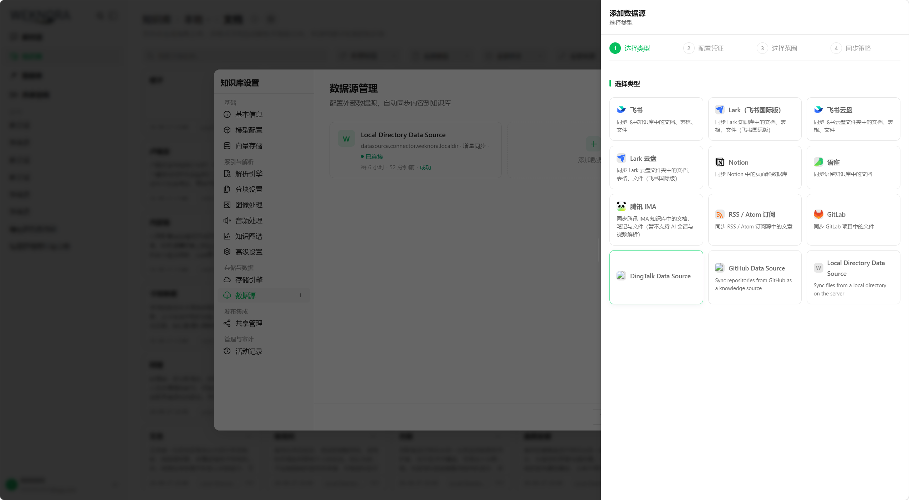
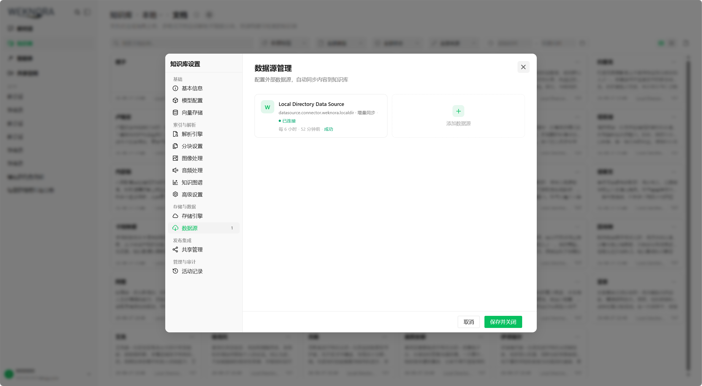
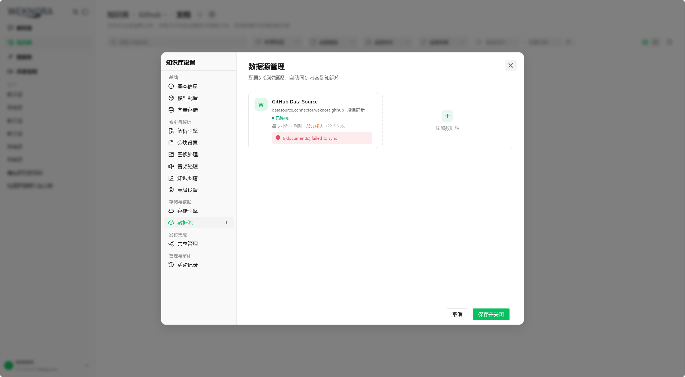
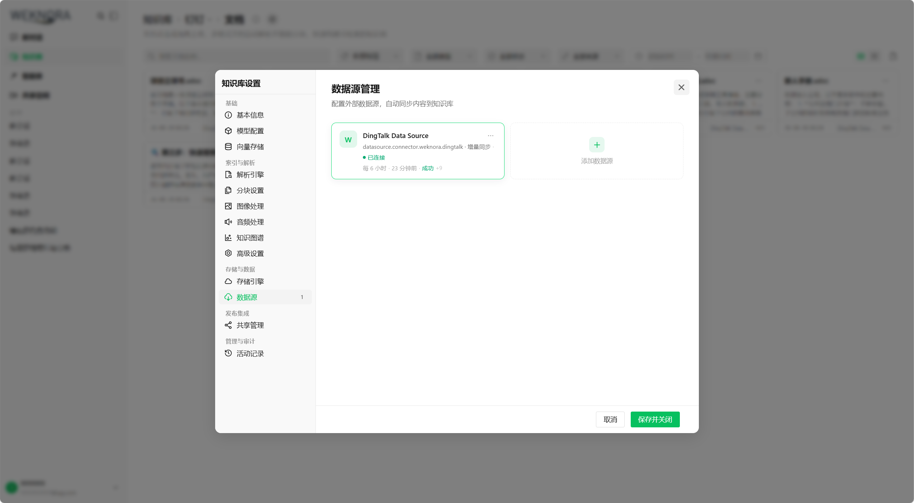
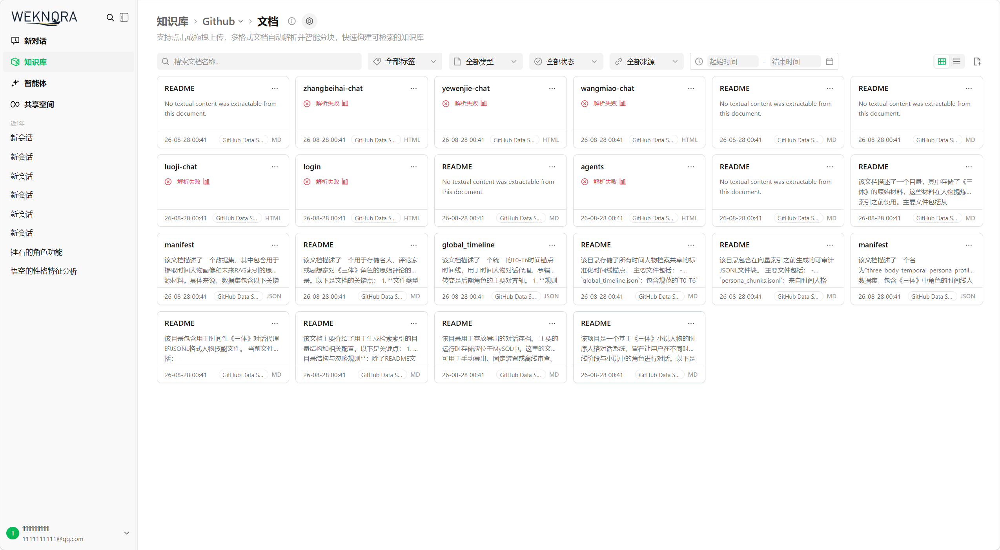

# WeKnora 插件框架（课题一）

> 本文档聚焦 WeKnora 的**统一插件控制面 + 五大扩展点插件化**。它不是 WeKnora 项目总览，而是"插件框架"这一课题的交付说明：架构、插件从落盘到运行的完整生命周期、治理能力、五个扩展点的制作文档入口。

> **已与上游同步**：本分支已合并上游 `Tencent/WeKnora` 的 `main` 分支共 203 个提交（同步点 `85b76d1a`），插件框架构建在同步后的代码底座之上，未与上游脱节。

## 实测验证

本课题已在 **Docker 部署**（生产态 OCI 沙箱运行时）与**快速开发模式**（开发态进程级运行时）两种运行方式下，完成了五类扩展点插件的端到端实测：

- **数据源（DataSource）**：以插件方式上传 GitHub、钉钉（DingTalk）等来源的文件，验证了增量同步与 Wiki 模式；
- **解析器（Parser）与检索器（Retriever）**：分别采用插件化的 BuiltinB 与 Milvux，完成文档解析与向量检索；
- **网络搜索（Web Search）**：配置 Tavily 实现联网搜索；
- **模型（Model）**：接入 DeepSeek 的深度思考能力提供问答。

以上五类插件的完整实现位于独立仓库 [WeKnora-plugin](https://github.com/wei-yan1/WeKnora-plugin)，以独立仓库方式开发、无需改动主仓代码即可装载——这正是「扩展点插件化」的落地形态。

五类扩展点均已端到端跑通，实测证据见「验收达成与关键难题解法」与第九节运行截图，实机测试过程见文末「实机测试演示视频」。安全框架另在 Docker 部署下通过 **19 项端到端控制点验收**（权限分离 / 强隔离沙箱 / 断网实测 / Socket 移交 / 信任分级持久化 / 全链路连通），详见「端到端验收实测」。

---

## 验收达成与关键难题解法

课题一设定了 4 条验收标准。下面先给出「验收标准 → 实现机制 → 实测证据」的逐条对照，再集中说明实现过程中攻克的关键难题及其解法。

### 验收标准逐条对照

| # | 验收标准 | 实现机制 | 实测证据 | 详见 |
|---|---|---|---|---|
| 1 | 主仓之外的独立仓库插件，免改主仓代码即可装载，并完成一次完整数据同步 | 五类扩展点统一为「Manifest 声明 + 进程外 gRPC」；插件由五个 `WEKNORA_PLUGIN_DIR_*` 目录驱动发现，经 `ExtensionAdapterRegistry` 动态接线，业务侧既有注册表以 factory 模式挂入，**业务路径一行未改** | GitHub、钉钉、LocalDir 三个数据源插件以独立仓库 [WeKnora-plugin](https://github.com/wei-yan1/WeKnora-plugin) 维护，主仓零改动完成完整同步 | 第二、三、四节 |
| 2 | 插件声明不联网时，运行期实际无法出站，尝试联网被拦截并记录 | 默认拒绝（默认 `offline`，需管理员显式授权）+ 信任只能收窄 manifest → 容器 `--network none` 无网卡 → 唯一出口是只读挂载的 egress 代理，在网络层校验白名单并审计；即便绕过 SDK 也在网络层兜底 | 19 项端到端实测全通过（含断网实测、白名单内放行/外拦截、SSRF 防护），每次放行与拦截均有审计留痕 | 第二、五、八节 |
| 3 | 增量同步正确：源端仅变更一个文件时，只有该文件被重新处理 | cursor 契约（插件解释语义、宿主原样存取）+ Outbox 模式（先落库再投递）+ 双层分布式锁（防重复触发、防并发拉取） | GitHub、钉钉均验证「仅变更一个文件 → 只有该文件被重新处理」 | 第二、五节 |
| 4 | 他人仅依据文档即可独立实现一个可运行的最简插件 | 五份独立完整文档（每扩展点一份）+ 协议级 conformance 自检入口 + 可复制模板目录 | 独立仓库五类插件均依据对应文档实现，作者无需阅读主仓源码 | 第六、七节 |

### 关键难题与解法

#### 难题一：五类扩展点注册机制各异、全部编译期注册，如何既统一又不改动业务代码？

**技术路线取舍**：在「编译期统一元数据」与「进程间 gRPC」两条路线中选择了后者。

- 编译期方案（Go 原生插件或注册表合并）要求插件与主仓**同版本编译、同进程运行**，既无法满足「独立仓库、免改主仓」，也无法提供安全隔离；
- 进程间 gRPC 让插件成为**独立进程或容器**：独立编译、独立发布，只要实现协议即可用任意语言编写，并可叠加隔离与资源边界；
- 代价是协议与生命周期的复杂度上升。为此把复杂度**全部收敛进框架**，抽象为四层：PluginManager（控制面）→ Runtime（运行形态）→ Adapter / gRPC Proxy（适配）→ Type-specific Registry（业务）。**新增第六类扩展点只需一个 Adapter + 一份 SDK 入口 + 一份文档**，五类业务路径保持不变。

#### 难题二：业务容器不能持有 docker.sock，如何安全地启动插件容器？

矛盾在于：插件要跑进容器就需要有人调用 Docker，但把 `/var/run/docker.sock` 挂给业务容器，等于交出宿主机 root 权限。

**解法：分权 + 窄接口 + 不信任上游参数。**

- 引入独立 `plugin-runtime-agent` 容器，**唯一持有** docker.sock；app 容器既不挂载 docker.sock、也不安装 docker CLI，只通过共享卷上的 Unix socket 调用 agent 的窄接口（start / stop / health）；
- agent **不信任 app 传来的参数**：收到请求后重新校验 plugin_id、协议版本、网络策略、资源限制，并以部署者配置的 `plugin_id → image@sha256` 白名单强制镜像来源（digest 防 tag 漂移、白名单防任意镜像）；认证 token 为空直接拒绝启动（fail-closed），比较采用常量时间算法；
- 跨容器 socket 通过**共享运行组**（GID 2000 + setgid 目录 + `0660`）完成属主交接，解决 `--cap-drop ALL` 后插件容器无法 chown 的问题，实现最小权限下的 socket 共享。

#### 难题三：插件崩溃、宿主或 agent 重启后，如何做到不残留、不串线？

- **generation fencing**：每次成功启动后 generation 递增，调用租约固定 generation，插件重启后旧连接引用自动失效——杜绝回调打到已死进程；
- **确定性容器名 + 双 label**：容器名保留 `.` / `_` 原字符，避免 `a.b` 与 `a_b` 碰撞；label 记录「agent 实例 ID + 插件 ID」，agent 重启时只清理自身创建的孤儿容器，不误伤其他部署；
- **热重扫自愈**：`POST /api/v1/plugins/rescan` 既是热增删改入口，也是自愈通道——外部误删的插件容器可在下一次刷新时被重新拉起，且单个插件失败不影响其他插件。

#### 难题四：跨进程增量同步，cursor 的语义由谁负责？

若宿主试图理解每种数据源的 cursor 结构，就必须为每种源内置 diff 逻辑，框架将失去通用性。

**解法：职责分离的 cursor 契约。** 插件理解语义（GitHub 是 commit SHA、钉钉是节点时间戳），宿主**只做原样保存与回传，从不解析**；删除以 `IsDeleted: true` 表达，更新按 `external_id` 决定 create / update。宿主因此对任意数据源通用，插件保留最大自由度；cursor 持久化在 `data_sources.last_sync_cursor`，插件进程重启不影响续传。

#### 难题五：如何让「不联网声明」成为运行期硬约束，而不是一句口号？

**解法：默认拒绝 + 声明与授权分离 + 运行期硬隔离 + 全程审计。**

1. **默认拒绝（default-deny）**：插件首次装载一律以 `offline`（强制不联网）启动，宿主不预置任何信任；必须由管理员在控制面**显式修改**信任级别，插件才可能获得联网能力。信任配置非法时，全部外部插件退回 `offline`（fail-closed）——安全默认值由后台先行设定，不依赖插件自觉；
2. **声明与授权分离**：插件在 Manifest 中标注的 `permissions.network` 只是其**声明的上限**，实际权限由管理员授予的信任级别决定；且**信任只能收窄、不能放宽**——`trusted` 声明 OCI 入口、`isolated` 非 OCI 入口，一律拒绝装载；
3. **运行期硬隔离**：容器以 `--network none` 启动，插件**没有网卡**，`net.Dial` 在操作系统层即失败；唯一出口是 per-plugin egress 代理 socket，**只读挂载**（能 connect、不能替换），代理在网络层再次校验：`none` 直接拒绝，`allowlist` 仅放行白名单域名（支持通配），并先 DNS 解析、再按解析出的 IP 拨号，**防 DNS rebinding TOCTOU**；
4. **隔离等级与部署形态绑定**：`isolated` 依赖 OCI 容器硬隔离，仅在 **Docker 部署**下可用；快速开发模式采用进程级运行，最高只能提供 `trusted` 级别的协作式软约束（依赖 SDK 的 `GuardedHTTPClient`）——这也是 `trusted` 仅适用于受信任插件的原因。

每一次放行与拦截都写审计（插件 ID + 目的地址 + 结果）；信任级别由管理员在统一控制面集中配置，插件与调用方都无法自行提升——多租户环境下，网络权限边界始终掌握在管理员手中。

### 端到端验收实测（19 项全通过）

在 Docker 部署环境下，使用自动化验收脚本对安全框架的关键控制点逐项实测（手段为 `docker inspect` + `psql` + 审计日志 + 管理 API），覆盖 6 组控制点：

| 控制点 | 实测内容 | 手段 |
|---|---|---|
| ① 权限分离 | app 容器**无** `docker.sock`；runtime-agent **独占** `docker.sock` | `docker inspect` 挂载列表 |
| ② 强隔离沙箱 | `network=none`、根文件系统只读、`cap-drop ALL`、`no-new-privileges`、`pids-limit 128`、`memory 512MB`、`cpus 1`、runtime 实例 label、plugin.id label —— 9 项全部符合 | `docker inspect` 容器配置 |
| ③ 断网实测 | `network:none` 下容器内 `wget http://example.com` 返回 `bad address`，**无任何出网通路** | 容器内实际发起请求 |
| ④ Socket 移交 | control socket 权限 `0660`、属组 `weknora-runtime`(GID 2000)、审计留痕 `socket-handover allowed=true` | `ls -la` + agent 审计日志 |
| ⑤ 信任分级持久化 | 信任等级落库 `system_settings`；`offline / trusted / isolated` 三档齐备；重启不丢 | `psql` 查询 |
| ⑥ 端到端连通 | isolated 插件经 agent 编排上线，`state=running`——宿主 ↔ agent ↔ 容器 ↔ socket 全链路贯通 | 管理 API |

**结果：19 项全部 PASS，0 项 FAIL。**

网络策略另有 4 项实测（第 20–23 项）：

| 场景 | 审计记录（runtime-agent 日志） |
|---|---|
| 白名单内放行 | `destination=api.tavily.com:443 allowed=true reason=allowed by managed egress proxy` |
| 白名单外拦截 | `destination=example.com:443 allowed=false reason=destination is not in manifest allowlist` |
| SSRF 防护 | `allowed=false reason=DNS resolved to a private or link-local address`——域名解析到私网或链路本地地址即拒绝，防 DNS rebinding |
| 信任矩阵 | 非法组合被拒装载：`trusted plugin cannot use OCI entrypoint` |

审计日志原始样例：

```text
[plugin-audit] plugin=weknora.tarily123 action=socket-handover
  destination=.../control/plugin.sock allowed=true
  reason=control socket ownership transferred to runtime group

[plugin-audit] plugin=weknora.tarily123 action=network
  destination=api.tavily.com:443 allowed=false
  reason=DNS resolved to a private or link-local address

[plugin-audit] plugin=weknora.tarily123 action=network
  destination=example.com:443 allowed=false
  reason=destination is not in manifest allowlist
```

这组实测直接支撑验收标准第 2 条——**「不联网声明在运行期被强制执行，且每一次放行与拦截都可审计」**：不仅有配置层面的信任收敛，更有运行期的物理断网与网络层拦截证据。

---

## 一、整体架构

WeKnora 的插件框架分为四层，自上而下：

```text
┌──────────────────── WeKnora Application ────────────────────┐
│  PluginManager                                              │
│    ├─ ManifestLoader          发现 / 校验 / 装载 plugin.yaml  │
│    ├─ CompatibilityValidator   weknora_version / 协议版本兼容  │
│    ├─ PluginRegistry           按 extension_type 注册工厂   │
│    ├─ LifecycleManager         启动 / 停止 / 守护 / 重启   │
│    ├─ HealthManager            周期性 Health + Admission    │
│    ├─ PermissionManager        network / read_paths / data  │
│    └─ AuditManager             装载 / 启停 / 调用审计       │
│                                                            │
│  Runtime                                                    │
│    ├─ BuiltinRuntime         内置扩展（飞书 / 语雀等）       │
│    ├─ ProcessRuntime         进程级 gRPC 插件（开发态）     │
│    └─ DockerRuntime          Docker/OCI 沙箱（生产态）      │
└────────────────────────────────────────────────────────────┘
                              │
        ┌─────────────────────┴─────────────────────┐
        ▼                                           ▼
┌─────────────── 内置扩展 Adapter ──────────┐   ┌──── 外部插件 gRPC Proxy ────┐
│  复用宿主现有连接器接口（如飞书/语雀/      │   │  gRPC proxy（带 invocation │
│  Notion/Ima/GitLab/RSS），走"内置单例"     │   │  context、admission、     │
│  通道，仅登记生命周期控制面               │   │  generation fencing）     │
│                                          │   │           ▼                │
│                                          │   │  Docker/OCI Runtime       │
└──────────────────────────────────────────┘   └────────────────────────────┘
                              │
                              ▼
┌──────────────── Type-specific Registry ────────────────┐
│   DataSource Registry   (内置 factory + 外部 plugin factory) │
│   Parser Registry                                         │
│   Search Registry                                         │
│   Model Registry                                          │
│   Retriever Registry                                      │
└────────────────────────────────────────────────────────┘
```

**核心思想**：宿主只负责稳定的扩展点、生命周期和最小协议；插件负责具体后端实现。内置与外部并存：内置走单例通道、外置走 factory 通道，**互不覆盖**。

四个层次各司其职：

| 层 | 职责 | 对应代码 |
|---|---|---|
| PluginManager | 发现、校验、注册、生命周期、健康、权限、审计 | `internal/plugin/{discovery,loader,runtime,admission,security}.go` |
| Runtime | 插件的实际运行形态（内置 / 进程 / 容器） | `internal/plugin/{builtin,process_runtime,docker_runtime}.go` |
| Adapter / gRPC Proxy | 把统一生命周期接到五类业务注册表；内置走单例、外部走 factory | `internal/plugin/*_registration.go` + `datasource_proxy.go` |
| Type-specific Registry | 宿主既有的五类注册表，插件注册进来后业务路径零改动 | `internal/datasource` 等 |

**插件如何被识别**：一个插件就是一个文件夹——里面一份 `plugin.yaml`（用 `extension_type` 声明"我是哪类插件"）+ 一个编译好的二进制。宿主启动时按五个环境变量 `WEKNORA_PLUGIN_DIR_{datasource,parser,search,model,retriever}` 递归扫描对应目录，读到 `plugin.yaml` 即识别为一个插件并装载（目录结构见第三节）。**新增插件 = 新建文件夹 + 放 `plugin.yaml` 和二进制，无需改主仓代码。**

**插件作者如何开发**：作者不必理解上面的架构或宿主代码，只需照对应扩展点的文档写 `plugin.yaml`、用 `pkg/pluginapi` SDK 填回调、编译成独立二进制。五类扩展点的文档与 SDK 入口索引见第六节；每份文档独立、完整、可盲测，末尾各带一个 conformance 自检入口（如 `RunDataSourceConformance`），作者本地即可做协议级冒烟验证。

---

## 二、插件生命周期：从磁盘上的文件夹到运行中的服务

**通俗地说**：以 GitHub 数据源插件为例——将编译好的 `weknora-plugin-github` 二进制和 `plugin.yaml` 放入插件目录，宿主下次启动（或在设置页点击"刷新插件"）时，插件会被发现、校验、注册，随后宿主把它作为子进程（或容器）拉起，通过 gRPC 握手确认身份与能力；此后知识库每一次同步 GitHub 仓库，实际执行者都是该独立进程。以下按真实代码逐阶段展开。

### 阶段 0：宿主接线

`internal/container/container.go` 在启动时做两件事：

- 读取系统设置里持久化的 `plugins.trust_levels`，注入 Manager（`ConfigureManagerTrust`；配置非法则 fail-closed，所有外部插件以 offline 启动），随后调用 `LoadExternalFromEnvWithRegistries`；
- 在内置 + 外部插件都注册并启动完成后，启动健康监督循环（`startPluginHealthSupervisor` → `manager.StartHealthSupervisor`，`RestartEnabled: true, MaxRestartCount: 3`，间隔与失败阈值取默认值 30s / 3 次）。

### 阶段 1：发现——找到磁盘上的插件

入口：`pluginRootsFromEnv`（`loader.go`）从五个环境变量 `WEKNORA_PLUGIN_DIR_{DATASOURCE,PARSER,SEARCH,MODEL,RETRIEVER}` 收集插件根目录（支持路径分隔符/逗号分隔多个目录）；未设置的变量跳过。

随后 `DiscoverPackages`（`discovery.go`）对每个根目录做 `filepath.WalkDir` 递归扫描，收集所有 `plugin.yaml` / `plugin.yml` / `plugin.json`：

- 每个 manifest 经 `LoadManifest` 解码并跑一遍 `Validate`（结构合法性在此把关）；
- **重复 ID 直接报错**（两个目录出现同一个 `id`，宿主拒绝启动而不是猜一个）；
- 记录 `SourceDir`（插件所在目录），后续用于解析插件自带的图标等资源。

### 阶段 2：解析执行计划——决定"怎么跑、能不能联网"

`loadOnePackage`（`loader.go`）对每个包调用 `ResolveExecutionPlan(manifest, trustLevel)`（`runtime_plan.go`）：

| 信任级别 | 隔离方式 | 网络 | 约束 |
|---|---|---|---|
| `offline`（默认） | 进程或容器均可 | `none` | 未配置信任的插件一律视为 offline，fail-closed |
| `trusted` | 仅进程（声明 OCI 直接拒绝） | 允许，但受 manifest 白名单约束 | 管理员显式信任的进程插件 |
| `isolated` | 仅 `docker://` OCI 容器 | 允许，受 manifest 白名单约束 | 必须走容器硬隔离 |

解析出的计划只作用于**运行时副本**（`runtimeManifest`），不修改磁盘上的 manifest——manifest 始终是插件作者声明的上限。

### 阶段 3：构造 Runtime 并注册到扩展点

按计划构造 Runtime（`loader.go:89-98`）：

- **OCI** → `newOCIRuntime`：配置了 `WEKNORA_PLUGIN_RUNTIME_AGENT_SOCKET` 时走 `RemoteRuntimeAgentController`（生产，请求经 Unix socket 发给 agent）；否则进程内 docker CLI（开发/单进程）。
- **进程** → `NewProcessRuntime(manifest, entrypoint)`。

随后按 `extension_type` 找到对应的 `ExtensionAdapter`（`adapter.go` 的 `ExtensionAdapterRegistry`），执行 `adapter.Register(manager, manifest, runtime)`。以数据源为例（`registration.go` `registerExternalDataSource`）：

1. `manager.Register`：再次 `manifest.Validate(hostVersion)` + `CapabilityReporter` 能力核对，然后登记 `pluginEntry`（状态机、generation、admission、lifecycle 锁）；
2. `registry.RegisterFactory`：把"按调用租约构造连接器实例"的工厂注册进 `ConnectorRegistry`——宿主既有的数据源调用路径**不需要任何改动**就能路由到外部插件；
3. 注册连接器元数据（名称/描述/图标/config_schema 透传前端）与插件目录内的图标文件。

注册失败会回滚该插件的全部局部状态（`rollbackLoad`：adapter.Unregister + manager.Unregister），保证重试从干净状态开始。其余四类扩展点（parser / search / model / retriever）各自有对应的 registration 文件，套路一致：**manager 登记生命周期 + 各自业务注册表登记调用入口**。

### 阶段 4：启动与握手——确认插件身份与能力

`manager.Start(ctx, id)`（`runtime.go`）在 per-plugin 生命周期锁内执行：

- 幂等：已启动直接返回；上一实例还在 draining、或还有旧调用未释放时拒绝启动；
- 状态置为 `starting`，调用 `runtime.Start(ctx)`。

**进程态**（`process_runtime.go`）：探测 `127.0.0.1` 空闲端口（最多 3 次重试 + 指数退避）→ `exec.Command` 启动插件子进程，注入 `WEKNORA_PLUGIN_ADDR`（监听地址）、`WEKNORA_PLUGIN_ID`、`WEKNORA_PLUGIN_PROTOCOL_VERSION`、`WEKNORA_PLUGIN_NETWORK_POLICY`、`WEKNORA_PLUGIN_NETWORK_ALLOWLIST` 五个环境变量 → stderr 管道接入审计（`ConsumePluginStderr`）→ gRPC 连接（10s 超时、50MB 消息上限，与 docreader 对齐）。

**容器态**（`docker_runtime.go` + `local_docker_controller.go`）：启动请求发给 runtime-agent（或进程内 docker CLI）。agent 校验通过后执行：

```text
docker run --rm --network none --read-only --cap-drop ALL \
  --security-opt no-new-privileges --pids-limit 128 --memory 512m --cpus 1 \
  -v <control-dir>:/run/weknora -v <egress-dir>:/run/weknora-egress:ro ...
```

插件容器没有网卡——联网只能经挂载进去的 egress 代理 socket（`egress_proxy.go`：域名+通配白名单、SSRF 拦截、逐次审计）。控制器等待插件创建 control socket 并完成属主交接（chown 到共享运行组 GID 2000 + `0660`），宿主才通过该 socket 建立 gRPC 连接。

**握手**：两条路径殊途同归——`PluginControl.Handshake` 拿到插件回报的 ID / 协议版本 / extension_type / capabilities，`validateHandshake`（`runtime.go`）做**双向严格校验**：runtime 回显了 manifest 未声明的能力、或 manifest 声明了 runtime 未回显的能力，都判装载失败。这保证"manifest 声明"与"运行时真实能力"永远一致。

全部通过后：`entry.started = true`，**generation 递增**（此后旧的调用租约自动失效），admission 恢复放行；模型插件还会异步触发一次配置重推（`fireModelConfigRepush`，把宿主 DB 里保存的模型配置重新投递给重启后的插件进程）。

### 阶段 5：健康监督与自愈

`healthSupervisorLoop`（`runtime.go`）每 30s 遍历所有已启动插件，逐个 `superviseOne`：

1. `runtime.Health(ctx)`（2s 超时）探测插件的控制面 Health；
2. `running` → 清零失败计数与重启计数；
3. 非 running → `healthFailures++`，连续 **3 次**（阈值）失败 → 标记 `unhealthy`；
4. 达到阈值且重启次数 < **3 次**（`MaxRestartCount`）→ 触发自动重启，每次降级/重启决策都写入监督审计（`recordSupervision`）；
5. `restartOne`：重新拿生命周期锁 + **校验 generation**（防止与手动操作并发重启同一个插件）→ drain 在途调用（超时强制取消）→ `runtime.Stop`（15s 宽限）→ 确认旧调用全部终结 → 重新 `Start`。

重启成功后 generation 再次递增——所有在途/后续调用都会拿到新连接。达到重启上限仍不健康的插件停留在 unhealthy 并被持续审计，不会再无限重启消耗资源。

### 阶段 6：业务调用——一次增量同步的完整路径

以"知识库同步 GitHub 仓库"为例：

```text
同步触发（手动/定时）
  → 创建 SyncLog + 落库（datasource_service.go，Outbox 模式：先持久化再投递）
  → dispatcher.Dispatch（sync_outbox.go）经 asynq 入队，TaskID = dssync:<dsID>:<logID>
  → Worker 取任务 → ProcessSync → ConnectorRegistry.GetForScope
  → 外部 factory（registration.go）：
      ① manager.AcquireInvocation —— admission 限流 + 固定 generation
      ② provider.Conn() 取"当前"gRPC 连接
      ③ 构造 GRPCConnectorProxy（unary）或 GRPCStreamingConnectorProxy（声明了
         streaming capability 的插件），与宿主侧 StreamingConnector 判定严格对应
  → 插件进程内 OnFetchIncremental：读 cursor → GitHub compare API → 增量 + 新 cursor
  → 宿主 Emit 入库 + Checkpoint 持久化 cursor（下次原样传回插件）
  → lease.Close() 释放租约
```

cursor 的契约由宿主与插件共同维护：**插件理解 cursor 的语义（GitHub 是 commit SHA，钉钉是节点时间戳），宿主只负责保存与原样传回，从不解释内容**。删除通过 `IsDeleted: true` 表达。插件进程重启不影响 cursor（它存在宿主 DB 的数据源记录里）。

### 阶段 7：热重扫——不重启宿主地增删改插件

设置页"刷新插件"按钮触发 `POST /api/v1/plugins/rescan` → `RescanExternalWithRegistries`（`loader.go`）：

- 重新 `DiscoverPackages`，与已加载清单对比；
- manifest 未变 + 信任级别未变 + 插件健康 → **Skipped**（幂等）；
- manifest 变更、信任级别变更、或插件此前 failed/unhealthy → **Changed**：用**旧 manifest** 推导旧 handle 卸载旧实例，再按新 manifest 重新装载——所以 rescan 同时是一次"自愈"通道（外部误删的插件容器可以在下一次刷新时被拉起）；
- 新出现的插件 → **Added**；
- 单个插件失败只记入 `Errors`，不影响其他插件。

信任级别的修改也遵循同一语义：`SetTrust` 只更新目标级别，插件继续以装载时的级别运行，直到下一次 rescan/重启才生效（前端以"待生效"圆点提示）。

---

## 三、插件部署目录结构

插件部署时，先建立一个总目录（例如 `D:\weknora-plugins`），再按扩展类型细分五个子目录，每个子目录对应一个环境变量：

```text
D:\weknora-plugins\          ← 总目录（名称任意）
├── datasource\              ← WEKNORA_PLUGIN_DIR_DATASOURCE
├── parser\                  ← WEKNORA_PLUGIN_DIR_PARSER
├── search\                  ← WEKNORA_PLUGIN_DIR_SEARCH
├── model\                   ← WEKNORA_PLUGIN_DIR_MODEL
└── retriever\               ← WEKNORA_PLUGIN_DIR_RETRIEVER
```

宿主启动时按这五个环境变量扫描对应目录，递归发现每个插件包里的 `plugin.yaml`（`plugin.yml` / `plugin.json` 亦可）。未设置的环境变量会被忽略；已设置但路径不存在会报错而非静默跳过。每个子目录下可放置多个独立插件包。

---

## 四、真实可用的插件示例（独立插件仓库）

插件示例与模板**不放在主仓源码中**，以独立插件仓库 [WeKnora-plugin](https://github.com/wei-yan1/WeKnora-plugin) 形式维护。开发者在不修改主仓任何代码的前提下，复制对应目录、改 `plugin.yaml` 的 `id` 和 `config_schema`，就能独立构建出一个新插件。

| 插件 | 扩展点 | 用途 | 仓库内路径 |
|---|---|---|---|
| **LocalDir** | `datasource` | 从本地目录扫描文件接入知识库；用于论文、笔记、文档等本地内容 | `datasource/weknora-plugin-localdir/` |
| **GitHub** | `datasource` | 同步 GitHub 仓库的 README / Markdown 文件到知识库 | `datasource/weknora-plugin-github/` |
| **DingTalk** | `datasource` | 同步钉钉文档到知识库 | `datasource/weknora-plugin-dingtalk/` |
| **BuiltinB** | `parser` | 独立文档解析插件（Markdown / TXT / CSV / JSON），验证外部解析引擎的装载与解析链路 | `parser/weknora-plugin-builtinb/` |
| **TARily** | `search` | Tavily Search API 的别名版搜索插件 | `search/weknora-plugin-tarily/` |
| **DS (DeepSeek)** | `model` | DeepSeek 聊天模型提供方（OpenAI 兼容） | `model/weknora-plugin-DS/` |
| **Milvux** | `retriever` | Milvus 兼容的向量检索引擎（别名 Milvux，避免与内置 Milvus 引擎类型冲突） | `retriever/weknora-plugin-milvux/` |

它们都验证了同一件事：**一个独立于 WeKnora 主仓的外部插件，能通过 Manifest 描述身份 / 能力 / 版本 / 配置 / 权限，由宿主发现、启动、管理，并通过进程外 gRPC 接入现有流程，且主仓零改动**。

插件仓库按 `datasource/ parser/ search/ model/ retriever/` 五个扩展点子目录组织，每个插件包含完整的 `plugin.yaml` + Go 入口 + 独立 `go.mod`（用 `replace` 指向本地 WeKnora 源码以便联调；独立发布时删除该 replace）。

---

## 五、插件框架治理能力（生产级）

| 能力 | 实现位置 | 作用 |
|---|---|---|
| **进程级限流（Admission）** | `internal/plugin/admission.go` | 每个插件有独立的最大并发、有限等待队列、排队超时；队列满 / 超时 / 插件 draining 返回结构化错误 |
| **分布式锁（同步任务互斥）** | `internal/datasource/sync_lock.go`（Redis token-owned 锁）+ `internal/datasource/scheduler.go` | trigger-lock 串行化创建 SyncLog + Asynq 入队；sync-lock Worker 续租；所有权丢失会取消同步 |
| **进程外 gRPC 通信** | `pkg/pluginapi/proto/plugin.proto` + 各扩展点 proxy | 进程外 RPC 调用，每个 RPC 携带 invocation context、admission lease、generation token |
| **进程隔离 / 沙箱** | `internal/plugin/process_runtime.go`（开发态）+ `internal/plugin/docker_runtime.go` + `local_docker_controller.go`（生产态） | DockerRuntime 使用 `--network none` 实现硬隔离；ProcessRuntime 不提供安全隔离，仅用于开发 |
| **网络策略 + 受控出站** | `internal/plugin/manifest.go`（声明）+ `internal/plugin/egress_proxy.go`（容器网络层强制）+ `pkg/pluginapi/guarded_client.go`（SDK 防护） | 插件声明 `network: none` / `allowlist`；isolated 插件经 runtime-agent 的 per-plugin 出口代理强制白名单（域名+通配、SSRF 拦截、审计）；`url` 类型字段自动走 SSRF 校验 |
| **插件生命周期** | `internal/plugin/runtime.go` | Handshake 双向能力校验 + Health 周期监督（30s / 阈值 3 次），失败自动 Restart（上限 3 次）且全程审计；Stop 先 drain 拒绝新 lease，超时强制取消 |
| **配置校验与脱敏** | `internal/datasource/httpclient.go`（SSRF）+ `internal/types/datasource.go`（AES-256-GCM 加密凭证）+ 前端 secret 锁头输入框 | 凭证字段加密存储，前端不回显明文，敏感字段在 UI 上以锁头展示 |
| **审计与追踪** | `internal/plugin/security.go` + `supervision_audit_test.go` + `audit_integration_test.go` | 插件装载、启动、停止、调用、网络放行/拦截、监督降级与重启等事件全部产生审计日志 |

### 数据源同步的双层分布式锁（生产化）

数据源同步是典型的"一次触发、要防并发"的场景，因此没有简单用单把锁，而是拆成两层边界（`internal/datasource/sync_lock.go`）：

| 锁 | 租约 / 续租 | 串行化边界 | 目的 |
|---|---|---|---|
| `trigger-lock`（触发锁） | 15s / 5s | 检查 pending/running → 创建 SyncLog → Asynq 入队 | 防止同一数据源被重复触发、重复入队 |
| `execution-lock`（执行锁） | 45s / 15s | connector 实际拉取执行 | 防止同一数据源并发拉取 |

生产级语义（不是简单 `SETNX`）：

- **token-owned**：每次获取生成随机 token，续租与释放都校验 token，只有持有者能释放；锁 key 带 `{dataSourceID}` hash tag，天然支持 Redis Cluster；
- **续租失败即取消**：后台 `renewLoop` 每 15s 续租，一旦续租失败立即 `cancel` 同步上下文，让 Worker 感知"锁已丢失"并停止，避免两实例同时写；
- **fail-closed**：Redis 故障时 `TryAcquire` 返回错误而非误判成功——宁可这次不同步，也不让两个实例并发执行；
- **本地同语义 fallback**：无 Redis（Lite 单进程）时退化为进程内 `map + mutex` 锁，接口与 Redis 版一致，不改变调用方语义。

配合 `internal/datasource/sync_outbox.go` 的 Outbox 模式：同步意图先落库、再投递队列，投递失败保留 `pending` 并指数退避重试——保证"同步一次、至少一次、可追踪"。

---

## 六、五个扩展点插件制作文档

每个扩展点都有独立、完整的"独立开发"指南，开发者只依据文档就能盲测实现一个新插件，无需阅读主仓源码。

| 扩展点 | `extension_type` | 文档 | SDK Handler |
|---|---|---|---|
| 数据源（DataSource） | `datasource` | [`docs/plugin-development-datasource.md`](docs/plugin-development-datasource.md) | `pluginapi.DataSourceHandler` |
| 文档解析（Parser） | `parser` | [`docs/plugin-development-parser.md`](docs/plugin-development-parser.md) | `pluginapi.ParserHandler` |
| 网络搜索（WebSearch） | `search` | [`docs/plugin-development-websearch.md`](docs/plugin-development-websearch.md) | `pluginapi.WebSearchHandler` |
| 模型管理（Model） | `model` | [`docs/plugin-development-model.md`](docs/plugin-development-model.md) | `pluginapi.ModelHandler` |
| 检索引擎（Retriever） | `retriever` | [`docs/plugin-development-retriever.md`](docs/plugin-development-retriever.md) | `pluginapi.RetrieverProvider` / `pluginapi.RetrieverBackend` |

每个扩展点文档的第 2 节都自带了五类扩展点共用的骨架速览（`extension_type`、`PluginControl` 握手/健康、`WEKNORA_PLUGIN_ADDR`、目录环境变量与权限），可直接从任一扩展点文档入门。

---

## 七、已知边界

- **检索引擎的高级能力**：`copy_indices` 等能力目前为可选 capability，尚未提升为必选；
- **部分扩展点的 UI 与流式能力**：模型管理的"plugin source"选项、检索引擎的 schema / credential 配置界面尚未接入前端；解析的流式化尚未实现；
- **隔离等级**：操作系统级硬隔离仅由 Docker/OCI 容器提供；进程形态（含快速开发模式）最高只能提供协作式软约束；
- **生产部署待验证项**：非 root 运行的插件容器访问 egress socket 的兼容性、以及插件容器 UID/GID 的 manifest 声明，尚未纳入验证范围。

---

## 八、架构流程详解：四层如何自上而下协作

本节按四层架构自上而下逐层展开，每层说明对应的源码模块、职责与关键设计。第二节从时间线视角描述插件的生命周期，本节则按模块拆解各层的职责与实现；一个请求如何贯穿四层，在本节末尾的「一张请求的完整旅程」中串联。

---

### 第一层：PluginManager —— 宿主控制面（internal/plugin 包的「大脑」）

#### Manager 维护的 `pluginEntry` 状态（`runtime.go:107-118`）

```text
pluginEntry
├─ manifest       Manifest                     装载时的 manifest 快照
├─ runtime        Runtime                      实际运行的 Process/Docker 形态
├─ state          HealthStatus                 状态机：discovered/starting/running/draining/degraded/unhealthy/stopped/failed
├─ generation     uint64                       每次成功 Start 后 +1，fencing 用
├─ started        bool
├─ healthFailures int                          连续 Health 失败计数
├─ restartCount   int                          已自动重启次数
├─ admission      *admissionController         单插件级并发限流器（见下文）
├─ lifecycle      sync.Mutex                   串行化"Start/Stop/Restart"
└─ loadedTrust    PluginTrustLevel             装载时生效的信任级别（与"已配置但未生效"区分）
```

#### 并发治理：每个插件一个 admission 控制器（`admission.go`）

| 参数 | 默认值 | 含义 |
|---|---|---|
| `MaxConcurrent` | **4** | 同一 runtime 同时允许的调用数 |
| `MaxQueued` | **100** | 超出并发上限后排队的请求上限 |
| `QueueTimeout` | **30s** | 排队等位的最长等待时间 |
| `DrainTimeout` | **30s** | Stop 时等待在途调用自然结束的超时 |

`acquire()`（`admission.go:79-130`）的三态机：

```text
进入 → active < MaxConcurrent？  → 占位 active[id] = cancelCall, 返回 ctx + release
        否 → waiting < MaxQueued？   → waiting++, 等 notify 或 QueueTimeout
                                  → 超时：rejected++，返回 AdmissionError(plugin_queue_timeout, retryable)
                                  → 满：rejected++，返回 AdmissionError(plugin_overloaded, retryable)
drain 模式：直接 rejected++，返回 AdmissionError(plugin_draining)
release：删 active[id]，cancel(nil)，signal() 唤醒下一个等待者
```

注意 `release` 用 `sync.Once`（`admission.go:99-100`）——重复释放只生效一次。**`cancelActive(cause)`** 在 `drain` 超时后强制取消所有在途调用（`admission.go:142-148`），让插件能立即 Stop。

#### invocation context 注入（`invocation.go`）

每次业务调用经 `acquirePluginCall`（`invocation.go:38-47`）租约后，把以下字段塞进 `pluginapi.InvocationContext` 注入 gRPC metadata：

| 字段 | 来源 | 用途 |
|---|---|---|
| `TenantID` | `datasource.ConnectorScope` 或 `ctx.Value(TenantIDContextKey)` | 插件侧做租户隔离 |
| `KnowledgeBaseID` | scope | KB 隔离 |
| `DataSourceID` | scope | 数据源隔离 |
| `OperationID` | request ID 或 `uuid.NewString()` | 幂等去重、链路追踪 |
| `TraceID` | OTel `SpanContext.TraceID()` | 链路追踪 |

`acquirePluginCall` 返回的 `generation`（`runtime.go` 增）固定本次租约——插件进程内 `provider.Conn()` 返回的连接就锁在这个 generation 上；进程重启 generation 递增，旧租约的 `conn` 引用自动失效（**fencing**，防止回调到已死进程）。

#### 适配层：discovery、validation、registration

- `discovery.go` `DiscoverPackages`：`filepath.WalkDir` 扫五个 `WEKNORA_PLUGIN_DIR_*` 目录，收集 `plugin.yaml` / `.yml` / `.json`；
- `manifest.go` `Validate`：语义版本（`semverPattern`）、ID 格式（小写字母数字 + `.-_`）、`extension_type` ∈ 5 选 1、`weknora_version` 在宿主版本范围内、`config_schema` 按 `settings` / `credentials` / `index_config`（仅 retriever）分区、`secret: true` 只允许在 `credentials`、网络策略为 `none` / `allowlist`（`egress` 已废弃）；
- `adapter.go` `ExtensionAdapterRegistry`：5 个 ExtensionAdapter 注册（`dataSource` / `parser` / `search` / `model` / `retriever`），每个 `Register(manager, manifest, runtime)` 把插件"接入"对应业务路径。

---

### 第二层：Runtime —— 插件到底"跑在哪"

#### 三种 Runtime 实现同一接口（`runtime.go:19-23`）

```go
type Runtime interface {
    Start(context.Context) error
    Stop(context.Context)  error
    Health(context.Context) HealthStatus
}
```

| Runtime | 何时选 | 形态 | 安全等级 |
|---|---|---|---|
| `BuiltinRuntime`（`builtin.go`） | 内置扩展（飞书 / 语雀 / Notion / GitLab / RSS / IMA 等） | 进程内单例，**只登记生命周期控制面** | 由既有实现保证 |
| `ProcessRuntime`（`process_runtime.go`） | 离线 / 信任 + 非 OCI entrypoint | 宿主子进程 + loopback gRPC | **协作式**，无 OS 级隔离 |
| `DockerRuntime`（`docker_runtime.go` + `local_docker_controller.go`） | 信任+OCI / 强制 OCI（`isolated`） | OCI 容器 | **硬隔离** |

**选择由 `runtime_plan.go` `ResolveExecutionPlan` 决定**：管理员为每个插件设的 `PluginTrustLevel`（`offline` 默认 / `trusted` / `isolated`）× `Entrypoint` 是否 `docker://` → 出 ExecutionPlan。**信任只能收窄 manifest**（`trusted` 声明 OCI 入口 → 装载失败；`isolated` 非 OCI → 装载失败）。

#### ProcessRuntime 启动（`process_runtime.go:51-153`）

```text
1. 探测 127.0.0.1 空闲端口（最多 3 次重试，指数退避 100/200/400ms）
2. exec.Command 启动子进程，注入 5 个环境变量：
   - WEKNORA_PLUGIN_ADDR=unix://... 或 tcp://127.0.0.1:port
   - WEKNORA_PLUGIN_ID=<manifest.id>
   - WEKNORA_PLUGIN_PROTOCOL_VERSION=v1
   - WEKNORA_PLUGIN_NETWORK_POLICY=none|allowlist
   - WEKNORA_PLUGIN_NETWORK_ALLOWLIST=host1,host2,*.example.com
3. stderr 管道 → ConsumePluginStderr 审计
4. grpc.DialContext（10s 连接超时，50MB 消息上限，insecure）→ Handshake → validateHandshake
5. 任一失败：关 conn + kill cmd + wait（不留半成品）
```

`Stop`（`process_runtime.go:165-198`）三段：关 conn（取消在途 RPC）→ SIGINT 给 5s grace → 仍未退出则 SIGKILL 强杀。

#### DockerRuntime 启动：完整的安全机制（`docker_runtime.go` + `local_docker_controller.go` + `agent_server.go`）

**生产形态下** `app` 容器**不挂 `docker.sock`**。启动请求通过 `WEKNORA_PLUGIN_RUNTIME_AGENT_SOCKET`（默认 `/var/lib/weknora/plugin-runtime/agent.sock`）发给独立的 `plugin-runtime-agent` 容器，由 agent 真正 `docker run`。

**agent 侧校验链**（`agent_server.go:194-230` `validateStartRequest`）：

| 字段 | 校验 |
|---|---|
| `PluginID` | 正则 `^[a-z0-9][a-z0-9._-]*$`（`agent_server.go:172`） |
| `ExtensionType` | 必须在 5 选 1 内 |
| `ProtocolVersion` | 必须 `v1` |
| `Image` | 非空 |
| `NetworkPolicy` | `none` 或 `allowlist`；后者必须 `AllowedDestinations` 非空 |

**agent 鉴权**：收到请求后 `s.authorized(r)`（`agent_server.go:107-118`）做 `Authorization: Bearer <token>` 头与 `s.authToken` 的 `subtle.ConstantTimeCompare` 比较——**空 token 启动 agent 直接拒绝**（`Serve` 的 `fail-closed`，`agent_server.go:90-92`）。

**镜像策略**（`image_policy.go`）：通过 `WEKNORA_PLUGIN_IMAGE_ALLOWLIST` 注入「plugin_id → image@digest」精确白名单（如 `weknora.dingtalk-datasource:ghcr.io/...@sha256:abc...`），agent 端 `Check` 在启动前强校验，**未声明或 digest 不匹配 → 拒绝**。`WEKNORA_PLUGIN_IMAGE_POLICY=development` 时绕过（仅限本地开发）。

**agent 启动容器时的 docker run 参数**（`local_docker_controller.go:250-271`，**与图里 Docker/OCI Runtime 对应**）：

```text
docker run --rm \
  --network none --read-only --cap-drop ALL \
  --security-opt no-new-privileges \
  --pids-limit 128 --memory 512m --cpus 1 \
  -v <control-dir>:/run/weknora:rw \
  -v <egress-dir>:/run/weknora-egress:ro \
  -e WEKNORA_PLUGIN_ADDR=unix:///run/weknora/plugin.sock \
  -e WEKNORA_PLUGIN_ID=<id> \
  -e WEKNORA_PLUGIN_PROTOCOL_VERSION=v1 \
  -e WEKNORA_PLUGIN_NETWORK_POLICY=... \
  -e WEKNORA_PLUGIN_NETWORK_ALLOWLIST=... \
  <image@sha256:...>
```

逐项解读：

| 参数 | 用意 |
|---|---|
| `--network none` | 容器**没有网卡**，任何出站请求只能经挂载进去的 egress 代理 socket |
| `--read-only` | 根文件系统只读，写入只能到挂载的 control/egress 目录 |
| `--cap-drop ALL` | **丢弃所有 Linux capabilities**（包括 CAP_NET_RAW、CAP_NET_ADMIN 等）——即使被攻破也降不到特权 |
| `--security-opt no-new-privileges` | **禁止 setuid/setgid 提权** |
| `--pids-limit 128` | 进程数封顶（fork bomb 防护） |
| `--memory 512m` / `--cpus 1` | 资源硬上限 |
| `-v <control-dir>:/run/weknora:rw` | control socket 挂载（gRPC server 监听） |
| `-v <egress-dir>:/run/weknora-egress:ro` | egress 代理 socket **只读**挂载——插件能 connect 但不能替换/删除 |

上述参数已在 Docker 部署环境下经 `docker inspect` 逐项核验通过（见「端到端验收实测」）。

**socket handover**（`local_docker_controller.go:167-198`）：插件进程在容器内 `listen` control socket 时是 root:root 0755（受 `--cap-drop ALL` 限制，chown 不出来），宿主侧 `handoverControlSocket` 循环等待 socket 出现后 **chown 到 GID 2000 + chmod 0660**——共享运行组（app / agent 同属 GID 2000）的成员才能 connect。这是"双容器共享卷 + 非 root 运行"的最小依赖。

#### Network egress：per-plugin 出口代理（`egress_proxy.go`）

插件容器 `--network none` 下不能直连外网。宿主给每个 isolated 插件起一个 **HTTP CONNECT 代理**监听在 Unix socket 上（`<egress-dir>/egress.sock`），挂载进容器**只读**。

```text
插件进程（容器内）
  ↓
egress.sock（ro 挂载的 Unix socket）
  ↓
EgressProxy.handle / handleConnect（egress_proxy.go:114-194）
  ├─ authorize(host, port) → NetworkGuard.authorize
  │    ├─ NetworkPolicy=none   → 拒绝（"plugin declares no network"）
  │    └─ allowlist 匹配      → 域名通配（*.example.com）+ DNS 解析 + SSRF 检查
  ├─ 用解析到的 IP 拨号（不直接用域名）—— 防止 DNS rebinding TOCTOU
  ├─ HTTP：transport.RoundTrip（TLSHandshakeTimeout=10s, ResponseHeaderTimeout=30s）
  └─ HTTPS：handleConnect 双向 io.Copy（HTTP/1.1 200 Connection Established）
  ↓
每请求记录到 Audit（plugin_id + 目的 + 是否放行）
```

`NetworkGuard.authorize`（`security.go`）是双层校验：manifest 声明的 `permissions.network` + 管理员配置的 `WEKNORA_PLUGIN_NETWORK_ALLOWLIST`，**即便插件绕过 SDK 的 `GuardedHTTPClient`（改用裸 `http.Client`），egress 代理仍在网络层兜底**。

**对 trusted 进程插件**（无容器）：宿主不做网络层强制，依赖 SDK 的 `GuardedHTTPClient`（`pkg/pluginapi/guarded_client.go`）做协作式校验（域名匹配 + 审计）。这是 `trusted` 级别的设计取舍：它适用于已受信任的插件；若需要网络层硬约束，应使用 `isolated`（OCI 容器）。

---

### 第三层：适配层 —— 五类扩展点的 Adapter 与 gRPC Proxy

这一层是「统一控制面」和「五类业务」之间的适配层。五个扩展点各有独立的 `*_registration.go`，但都遵循同一套骨架：**`manager.Register` 登记生命周期 → 各自业务注册表登记调用入口 → 每次调用经 admission 取连接构造 Proxy**。下面先讲清共用的 Proxy 骨架，再逐个展开五类的特有设计。

#### 共用的 Proxy 骨架（五类一致的 4 步）

```text
1. ExtensionAdapter.Register(manager, manifest, runtime)
   ├─ manager.Register：manifest.Validate + CapabilityReporter 双向校验 + 登记 pluginEntry
   └─ 各自 Registry 登记调用入口（见五类各自展开）

2. 业务路径取连接（每次调用时）
   ├─ Manager.AcquireInvocation → admission 限流（MaxConcurrent=4 / MaxQueued=100 / QueueTimeout=30s）
   │                              + 固定 generation（fencing）
   ├─ provider.Conn() 取「当前」gRPC 连接（第二层 Runtime 维护，generation 变化后自动失效）
   └─ 构造该扩展点对应的 GRPC Proxy

3. gRPC 调用 + 返回
   ├─ 注入 invocation context（TenantID/KnowledgeBaseID/DataSourceID/OperationID/TraceID）
   ├─ 插件侧 SDK 读 metadata、执行业务、写响应
   └─ 宿主解码响应

4. lease.Close() 释放 admission（信号量 -1，唤醒下一个等待者）
```

**关键设计**：`GetForScope` 先查外部 factory、查不到回退内置单例（`datasource/connector.go:147-156`）——外部插件能覆盖内置实现，也正因如此外部插件的 `connector_type` / `engine_type` 强制不能与内置重名（防 shadow）。streaming 能力判定（B 方案）：manifest 声明 `streaming` 才构造 `GRPCStreamingConnectorProxy` 走流式路径，否则走批量 `FetchIncremental`。

#### ① 数据源（DataSource）适配：完整的同步处理流程

**入口**：`DataSourceService.ManualSync`（`datasource_service.go`）或 `startDataSourceScheduler`（cron 触发）→ 构造 `DataSourceSyncPayload{DataSourceID, TenantID, SyncLogID, ForceFull, Trigger: "manual" | "scheduled"}`。

**Outbox 模式**（`sync_outbox.go`）：同步意图**先落库再投递队列**，投递失败时保留 `pending` 状态由后台 dispatcher 指数退避重试——保证「至少一次、可追踪」。

```text
1. 创建 SyncLog（status=pending）落 DB
2. syncLog.TaskID = SyncTaskID(dsID, logID) = "dssync:<dsID>:<logID>"
3. syncLog.TaskPayload = JSON(payload)
4. dispatcher.Dispatch → asynq.Enqueue(TaskID=log.TaskID, MaxRetry=5, Timeout=2h)
   ├─ 成功：log.DispatchedAt 标记 + 入队
   └─ 失败（非冲突类致命错）：MarkDispatchFailure + 指数退避（1/2/4/8…分钟，阈值后告警）+ 重试
```

**双层分布式锁**（`sync_lock.go` `SyncCoordinator`）—— 课题一的核心设计：

| 锁 | key | 租约 / 续租 | 串行化边界 | 防的是 |
|---|---|---|---|---|
| `trigger-lock` | `weknora:datasource:{<dsID>}:trigger-lock` | **15s / 5s** | "检查 pending/running → 创建 SyncLog → Asynq 入队" | 同一数据源被**重复触发、重复入队**（cron + 手动同时点） |
| `execution-lock` | `weknora:datasource:{<dsID>}:sync-lock` | **45s / 15s** | "connector 实际拉取执行" | 同一数据源**并发拉取**（两个 Worker 同时跑） |

**关键设计**（不是简单 `SETNX`）：

- **token-owned**：每次获取生成 `redislock.NewToken()`，续租与释放都校验 token，只有持有者能释放——**防误释放**（`sync_lock.go:160-174`）；
- **key 带 hash tag `{<dsID>}`**：天然支持 Redis Cluster，所有该数据源相关键落在同一 slot；
- **续租失败即取消**（`sync_lock.go:175-196`）：`renewLoop` 每 5s/15s 续租，失败立即 `cancel(cause)` 上下文，Worker 感知"锁已丢失"后主动停止——**防两实例同时写**；
- **fail-closed**（`redislock.TryAcquire` 错误时直接返回）：Redis 故障时宁可不同步也不让两实例并发；
- **本地 fallback**（`localSyncLocker`，`sync_lock.go:93-107`）：Lite 单进程无 Redis 时退化为进程内 `map + mutex`，接口与 Redis 版一致，调用方零感知。

**Worker 取到任务后**：

```text
ProcessSync（datasource_service.go:1114-）
  ├─ streamStartCursor(ds, forceFull, attempt) → cursor
  │    ├─ forceFull && attempt==0 → nil（全量）
  │    └─ 否则 → ds.ParseSyncCursor()（DB last_sync_cursor）
  ├─ if connector implements StreamingConnector → processSyncStreaming
  │    ├─ handler.Emit(item) → KnowledgeService.Ingest（边拉边入）
  │    └─ handler.Checkpoint(cursor) → DB 持久化（断点续传）
  └─ else → processSync（普通批量路径）
       ├─ forceFull || SyncMode==Full → connector.FetchAll
       └─ 否则 → connector.FetchIncremental（cursor 进出）
            → items 批量入库 → 更新 last_sync_cursor
```

**增量同步的 cursor 契约**（**这是课题验收点 3 的核心**）：

- 插件自己读 cursor（GitHub 用 commit SHA、钉钉用节点时间戳——**不规定 cursor 内部结构**）；
- 宿主**原样保存**到 `data_sources.last_sync_cursor`（JSONB）；
- 宿主**原样回传**给插件（`request.Cursor`），绝不解析；
- 删除通过 `IsDeleted: true` 表达（插件在 diff 时发现 cursor 里有、这次 list 里没有 → 返回 `IsDeleted=true`）；
- 改动通过返回普通 item 表达（带相同 `external_id` + 新内容 → 宿主用 `external_id` 决定 create/update）；
- **一致性边界（at-least-once，失败不推进 cursor）**：致命拉取错误、或本批次存在处理失败的条目时，宿主**不前进 cursor**，下一轮重新拉取同一批（含本批已成功的条目），避免未处理的文档被 cursor 永久跳过；代价是条目处理必须幂等，宿主侧更新采用「先建新版本、成功后删旧版本」的替换语义，删除旧版本失败只残留重复、不丢数据。

#### ② 文档解析（Parser）适配（`parser_registration.go`）

**注册入口**：`RegisterExternalParser` → `docparser.RegisterEngine(externalParserRegistration{...})`。关键结构 `externalParserRegistration` 实现 `docparser.EngineRegistration` 接口：

| 方法 | 作用 |
|---|---|
| `Name()` / `Description()` | 引擎名（`metadata.engine_name`，默认插件 id）+ 描述 |
| `ConfigSchema()` | 透传 manifest 的 `config_schema`（settings/credentials），驱动 Parser 设置页 |
| `FileTypes(bool)` | 返回 `metadata.file_types`（如 `pdf`、`docx`），**空则装载失败**——宿主靠它做文件类型路由 |
| `CheckAvailable(bool, map[string]string)` | **读 manager.HealthSnapshot 而非主动探测**：插件进程崩溃后，health supervisor 一个周期内就会把状态翻成非 running，这里据此判定引擎不可用 |
| `NewReader(ctx, deps)` | `provider.Conn()` 取连接 → 构造 `GRPCParserProxy`（`Client: pluginapi.NewParserPluginClient(conn)`） |

**特有设计**：parser 是无状态「字节 → 文本」的一次性 RPC，但 `CheckAvailable` 不真 ping 引擎——它信任第一层 Manager 的 `HealthSnapshot`（由 Start 后握手 + 监督循环维护），因为主动探测会加重引擎负担，且无法区分「引擎进程死」和「引擎后端慢」。

#### ③ 网络搜索（WebSearch）适配（`web_search_registration.go`）

**注册入口**：`RegisterExternalWebSearch` → `registry.RegisterWithInfo(providerType, factory, info)`。factory 的签名是 `func(params WebSearchProviderParameters) (WebSearchProvider, error)`：

```text
每次创建 provider 实例（按租户配置）时：
  conn := provider.Conn()                     ← 取当前连接
  client := pluginapi.NewWebSearchPluginClient(conn)
  return &GRPCWebSearchProxy{Client, Params, NameValue, Manager, PluginID}
```

**特有设计**：web search 是**按租户即时调用**的 `ProviderFactory`，不是一次性同步。因此「凭证」被挡在 factory 边界外——`params.APIKey` 随每次 `Search` 请求传入，**不写进插件进程的全局状态**，一个长生命周期插件进程能服务多个租户而互不串凭证。保留 key（`api_key`/`engine_id`/`base_url`/`proxy_url`）由宿主内置表单区渲染，不重复成自定义字段。

#### ④ 模型（Model）适配（`model_registration.go`）

**注册入口**：`RegisterExternalModel` → `modelprovider.RegisterExternalModelResolver(providerName, resolver)`。resolver 的签名：

```text
func(ctx, modelID) (ModelPluginClient, ctx, release, err)
  lease := manager.AcquireInvocation(ctx, pluginID)    ← admission + generation
  conn  := provider.Conn()
  callCtx := pluginapi.WithInvocationContext(lease.Context, invocationFromContext(ctx, ""))
  return pluginapi.NewModelPluginClient(conn), callCtx, lease.Close
```

**特有设计**（模型是五类里最复杂的一个）：

- **每次调用动态解析连接**：模型插件承载有状态长连接（对话流），宿主**不缓存固定 client**，每次 Chat/Embed 都走 resolver 现取连接——插件重启后下次调用自动拿到新连接，旧连接因 generation fencing 失效；
- **一个进程承载五种能力**：`chat` / `embedding` / `rerank` / `vllm` / `asr`，`Capabilities` 声明实现了哪些，未实现的回调留 nil（调用时返回 "not implemented"）；
- **配置一次性投递 + 重启重推**：`base_url` / `api_key` 只在「保存模型」时经 `ValidateConfig` 传入一次，插件在进程内缓存；重启后缓存清空，宿主靠 `ModelConfigRepusher`（`runtime.go` 的 `fireModelConfigRepush`）在每次 (re)start 后异步重推；
- **`model_ui` 声明**：`features`（thinking/streaming/vision/tools）与 `host_fields`（base_url/api_key 等公共字段的显隐策略）由插件声明，宿主透传给前端动态渲染，无需硬编码。

#### ⑤ 检索引擎（Retriever）适配（`retriever_registration.go`）

**注册入口**：`RegisterExternalRetriever` → `registry.put(RetrieverProviderInfo{EngineType, Capabilities, OpenSession, GenerationValid})`。与其它四类「每次调用构造 client」不同，retriever 是**有状态会话**——`OpenSession` 工厂打开一个 store 会话：

```text
OpenSession(config):
  lease := manager.AcquireInvocation(ctx, pluginID)
  conn  := provider.Conn()
  client := pluginapi.NewRetrieverPluginClient(conn)
  desc, _ := client.Describe(...)                       ← 懒加载 ScoreSemantics
  resp  := client.OpenStore(RetrieverOpenStoreRequest{Config})
  return client, resp.StoreHandle, lease.Generation     ← store_handle + 绑定 generation
```

**特有设计**（retriever 是唯一有状态的扩展点）：

- **`store_handle` 不透明会话**：`OpenStore` 返回 SDK 生成的不透明 handle，之后所有 `BatchPut` / `Search` / `Delete` / `Patch` 都携带它——插件自己维护「一个 store = 一个后端连接/索引」；
- **懒加载 `ScoreSemantics`**：注册时插件进程尚未启动（loader 先 Register 后 Start），所以 `Describe` 不能注册时调；宿主改在**首次 `OpenStore` 时**调 `Describe` 读分数语义（`similarity_higher_better` / `distance_lower_better` / `rank_only`）并缓存，供跨引擎归一化；
- **引擎类型防 shadow**：`types.IsValidEngineType(engineType)` 拒绝与内置引擎（postgres/qdrant/milvus 等）重名的外部引擎，提示用别名 + 声明 `score_semantics`；
- **`GenerationValid` 回调**：store 会话绑定的 runtime generation 变化后（插件重启），宿主据此懒重开会话——不缓存死连接；
- **无缝接入内部仓库**：自愈式 `GRPCRetrieverRepository` 已接入宿主内部 `RetrieveEngineRepository`，外部检索引擎对上层业务流程完全透明。

#### 五类适配对照小结

| 扩展点 | 注册入口 | 调用形态 | 特有设计 |
|---|---|---|---|
| 数据源 | `ConnectorRegistry.RegisterFactory` | 一次性同步 / 流式同步 | Outbox + 双层分布式锁 + cursor 契约 + 增量/删除 |
| 文档解析 | `docparser.RegisterEngine` | 无状态 `Parse` RPC | `FileTypes` 路由 + `HealthSnapshot` 判可用 |
| 网络搜索 | `WebSearch.Registry.RegisterWithInfo` | 按租户即时 `Search` | 凭证挡在 factory 边界外，多租户隔离 |
| 模型 | `modelprovider.RegisterExternalModelResolver` | 每次调用动态解析 | 五能力并存 + 配置一次性投递 + 重启重推 + model_ui |
| 检索引擎 | `RetrieverProviderRegistry.put` | 有状态 `OpenStore` 会话 | store_handle + 懒加载 ScoreSemantics + generation 懒重开 |

---

### 第四层：Type-specific Registry —— 落到宿主既有业务

最底层是五类业务注册表，**插件框架零改动**这些已有代码：

| Registry | 文件 | 承载的扩展点 | 关键类型 |
|---|---|---|---|
| `ConnectorRegistry` | `internal/datasource/connector.go` | 数据源 | `Connector`（`Validate` / `ListResources` / `FetchAll` / `FetchIncremental`）+ `ConnectorFactory` |
| `ParserRegistry` | 文档解析模块 | 文档解析 | parser Engine |
| `WebSearch.Registry` | `internal/infrastructure/web_search` | 网络搜索 | `WebSearchProvider` |
| `ModelProviderRegistry` | 模型模块 | 模型 | `Chat` / `Embed` / `Rerank` / `VLM` / `Transcribe` |
| `RetrieverProviderRegistry` | `internal/plugin/retriever_registration.go` | 检索引擎 | `RetrieverProvider` + `RetrieverBackend` |

注册表以下，宿主既有的同步、解析、检索、模型调用流程**完全不变**。插件框架的"统一"价值就在于：五类业务共用同一套 PluginManager + Runtime + Adapter + Proxy，新增第六类扩展点只需写一个新 Adapter + 一份 SDK 入口 + 一份制作文档。

---

### 一张请求的完整旅程（四层串起来）

以「用户在知识库里点一次 GitHub 数据源的立即同步」为例，把四层 + 关键设计全部走一遍：

```text
① 业务层（第四层之上）
   ManualSync → 双层分布式锁的 trigger-lock 拿到 → 创建 SyncLog 落库
   → sync_outbox.Dispatch → asynq.Enqueue(dssync:<dsID>:<logID>)

② Worker 取任务 → processSync
   streamStartCursor(ds, forceFull=false) → ds.ParseSyncCursor()（上次的 cursor）
   → 调 connector.FetchIncremental(ctx, config, cursor)

③ connector 是外部插件 → ConnectorRegistry.GetForScope
   ─→ factory 命中（registration.go 的 RegisterFactory 注册的）
   ─→ acquirePluginCall：
         Manager.AcquireInvocation（admission: MaxConcurrent=4, MaxQueued=100, QueueTimeout=30s）
         → 拿 lease（固定 generation、注入 invocation context）
       provider.Conn() 取当前 gRPC 连接（第二层 Runtime 维护）
   ─→ 构造 GRPCConnectorProxy（无 streaming capability → 普通 batch proxy）

④ proxy.FetchIncremental → gRPC
   metadata 注入：TenantID, KnowledgeBaseID, DataSourceID, OperationID, TraceID
   → 插件进程 OnFetchIncremental
       读 request.Cursor → GitHub compare(prev, head) → 增量文件 + 新 cursor
       （isolated 插件的出站请求经 EgressProxy 强制白名单 + 审计）

⑤ 结果沿原路返回
   proxy 解码 → items 批量入库（KnowledgeService.Ingest）
              → 更新 data_sources.last_sync_cursor = 新 cursor
   lease.Close() 释放 admission（信号量 -1，唤醒下一个等待者）

⑥ 期间健康监督循环（每 30s 跑一次 runtime.Health）
   3 次连续失败 → State=Unhealthy → 自动 Restart（最多 3 次）
   Restart 流程：drainAdmission(30s) → 强 cancelActive → runtime.Stop(15s) → 重新 Start
   成功后 generation +1，所有旧租约的 conn 引用自动失效（fencing）
```

整个路径里：

- **第一层**只出现在"申请/释放租约、状态机推进、调度监督"三个点；
- **第二层**只提供"连接"——进程态保持子进程存活、容器态保持 control socket 存活；
- **第三层**负责"翻译与护送"——invocation context 注入、admission 限流、generation fencing、gRPC 编解码；
- **第四层**负责"路由"——把请求分发到内置/外部对应实现。

每一层**只做自己该做的事，不越界**。这就是「统一架构 → 分层管理」的具体含义——**统一**是 PluginManager 抽象出插件这一统一概念，**分层**是各层职责互不侵入，新扩展点只需插在第三/四层之间。

---

## 九、运行效果截图

以下截图来自外部数据源插件的实际运行，展示了「插件类型动态出现在创建列表 → 配置 → 同步 → 文档进入知识库」的完整链路：











---

## 十、实机测试演示视频

以下是五类扩展点插件在 Docker 部署与快速开发模式下的实机测试录像（共 7 段）：

- `
https://github.com/user-attachments/assets/5a8588c0-5fba-4f31-b7b5-a48e087e1341
`

https://github.com/user-attachments/assets/e8a28f84-36df-446c-a04b-32837c9a907c


https://github.com/user-attachments/assets/36049a52-c3f5-4ea4-84f3-176e6ffb4ee9


https://github.com/user-attachments/assets/3bdc9c73-2cf8-4de9-ad56-f2b0de63cd15


https://github.com/user-attachments/assets/a375a955-ec32-405c-8bc5-08c653acc6f6


https://github.com/user-attachments/assets/c7ae3364-633c-4b3a-810a-c82c661d5dba


https://github.com/user-attachments/assets/7e451b7d-0806-437a-ac63-284dcf427da6

